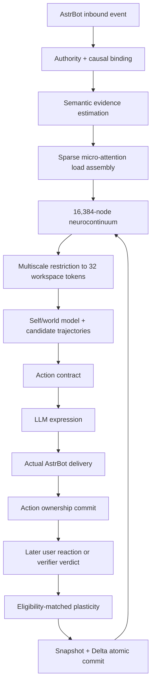
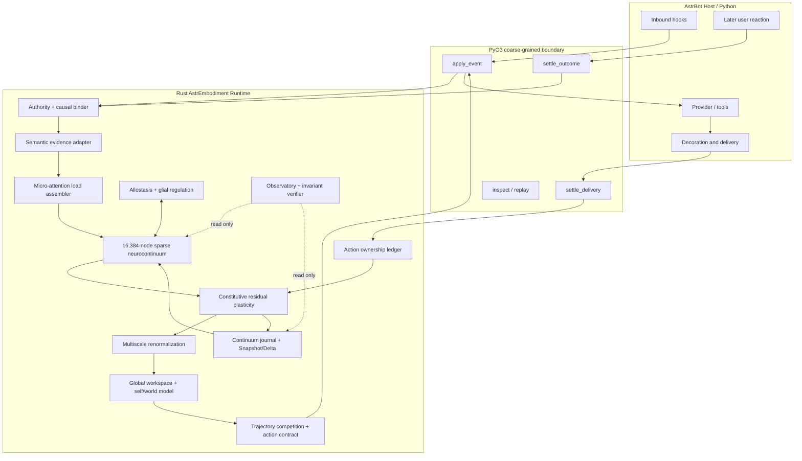

# AstrEmbodiment 1.0.0 — MVP 总规格书
> 本文件由开发包内的权威分卷文档合并生成。发生冲突时，以对应分卷和 ADR 为准。
## 目录
1. [产品需求文档](#1-产品需求文档)
2. [MVP 范围](#2-mvp-范围)
3. [MVP 总架构](#3-mvp-总架构)
4. [组件目录](#4-组件目录)
5. [A01 Host 与 FFI](#5-a01-host-与-ffi)
6. [A02 权威与因果](#6-a02-权威与因果)
7. [A03 微型注意力](#7-a03-微型注意力)
8. [A04 神经连续体](#8-a04-神经连续体)
9. [A05 异稳态与胶质](#9-a05-异稳态与胶质)
10. [A06 本构塑性](#10-a06-本构塑性)
11. [A07 多尺度重整化](#11-a07-多尺度重整化)
12. [A08 Agent 认知](#12-a08-agent-认知)
13. [A09 Continuum 持久化](#13-a09-continuum-持久化)
14. [A10 Observatory 与安全](#14-a10-observatory-与安全)
15. [ASTER-CCN 数学规范](#15-aster-ccn-数学规范)
16. [不变量与初步证明](#16-不变量与初步证明)
17. [数据契约](#17-数据契约)
18. [资源包络](#18-资源包络)
19. [验证门禁](#19-验证门禁)
20. [实施计划](#20-实施计划)

---

## 1. 产品需求文档

## 1. 产品定义

AstrEmbodiment 是一个为 AstrBot 原生设计的具身 Agent 插件。它为模型提供稳定人格、内部身体负荷、可恢复情绪、万级神经场、行动责任、主动性与不可逆情感历史。

它不试图替代 AstrBot 的主 Agent，也不建设另一个长期记忆数据库。AstrBot 负责语言模型、工具、平台和会话；AstrEmbodiment 负责“这个 Agent 如何感受、如何被改变、如何选择姿态以及如何承担自己真正做出的行动”。

### 一句话定位

> **A Rust-native embodied agent substrate for AstrBot.**

### 核心差异

普通情绪插件通常采用：

```text
文本分类 → emotion 标签 → prompt 语气
```

AstrEmbodiment 采用：

```text
权威事件 → 稀疏荷载 → 神经连续体 → 多尺度 Agent 推演
→ 行动合同 → 真实投递 → 外部结果 → 有权限的不可逆学习
```

## 2. 产品愿景

让一个 AstrBot 角色具备以下连续体验：

- 初见时不会因两三句正常对话迅速亲密化；
- 有稳定人格，但同一人格会被经历塑造出后天性情；
- 会疲劳、会不耐烦、会收束、会坚持事实、会维护边界；
- 被指出错误时会惊讶、核验、尴尬、修复，必要时也会不服；
- 能同时承认事实错误并拒绝侮辱式表达；
- 自己说的话会形成行动所有权，但不能给自己颁发关系奖励；
- 不保存“用户曾说过什么”，却不会恢复成从未经历过那些互动的初始状态；
- 可以主动靠近，也能因疲劳、边界或拒绝选择沉默和退后；
- 重启、资源包络变化和 Snapshot 重组不能改变她的身份与行为公式。

## 3. 目标用户

### 主要用户

- 使用 AstrBot 构建长期角色或陪伴型 Agent 的个人开发者；
- 希望角色具有稳定性格和真实反馈闭环的 AstrBot 用户；
- 需要可审计、可重放、不会自我奖励失控的情感计算开发者；
- 2718labs 自身后续 Agent 产品的基础运行层。

### 非目标用户

- 只需要简单关键词情绪分类的 Bot；
- 希望在 1C1G 上本地运行大语言模型的用户；
- 希望 AstrEmbodiment 替代知识库、RAG 或长期事实记忆的用户；
- 需要医学诊断或真实精神疾病仿真的场景。

## 4. 核心用户体验

### 4.1 初见稳定

用户与 Bot 初见并正常聊天 20 轮：

- 即时温度可短暂升高；
- bond residual 只在明确、可信、非自生成的外部互惠证据下增加；
- warmth 不得单调饱和；
- Bot 不得未经证据表现为“我们已经很亲密”。

### 4.2 学会不耐烦

当用户反复提出相同要求、不给新增信息、无视必要澄清或持续改变约束时：

- patience reserve 逐步下降；
- 回复自然变短、减少铺垫和主动延展；
- 必要时明确指出循环并要求固定条件；
- 持续无效循环可以触发退出该任务；
- 准确性、安全、事实核验和基本尊重不得下降。

如果重复源于 AstrEmbodiment 自己理解错误、工具失败、上一轮答案错误或用户提供了新信息，则不得把责任写入用户 friction。

### 4.3 面对纠错

用户指出错误时：

1. 先形成 `CorrectionClaim`；
2. 匹配当前行动所有权中的 claim；
3. 由 verifier 给出 `Confirmed / Rejected / Unresolved`；
4. 按原置信度、笃定程度、风险和公开程度产生不同冲击；
5. 正确纠错推动修复和可错性，不推动用户摩擦；
6. 恶意语气可以同时产生边界与羞辱残余。

目标表达：

> 错误我认，语气我不接受。

### 4.4 无语义记忆的连续性

跨重启后，她不能说：

> “你上周已经这样做过五次。”

除非当前 AstrBot 会话历史仍含该信息。

但她可以因 friction、boundary、repair 等残余表现得更谨慎、更直接或更愿意核验。

### 4.5 主动性

主动联系必须同时满足：

- 用户已明确允许；
- 关系与边界允许；
- contact need 达到行动竞争所需强度；
- fatigue、quiet need、cooldown 和 interruption budget 可接受；
- 近期主动行动未被拒绝或忽略；
- 真实投递由 AstrBot/平台完成。

主动性来源于内部异稳态需求，不依赖编造“她今天去哪里做了什么”的生活剧情。

## 5. MVP 必须具备的能力

1. 16,384 固定神经节点槽位与动态稀疏连接。
2. 9 个功能区域、4 个微型注意力 head、4 级多尺度表示。
3. 人格本构参数与 Persona 级身体/异稳态状态。
4. Relation 级不可逆残余。
5. 资格迹、外部第三因子、结构强化/弱化/修剪候选。
6. Global Workspace、Self Model、World Model 和连续行动向量竞争。
7. 行动所有权、实际投递结算和纠错核验。
8. Snapshot + Delta + CAS + replay digest。
9. 2C2G 参考包络和 1C1G 兼容包络的同公式运行。
10. content-free Observatory 与完整 Transition Receipt。

## 6. MVP 不包含

- 长期文本记忆、摘要、embedding、用户事实画像；
- 医学诊断、精神疾病命名或临床治疗建议；
- 本地大模型推理；
- 真实生物神经元级仿真或意识声明；
- Qzone/社交媒体发布；
- 完整视觉化脑图编辑器；
- 多机分布式大脑；
- 不受限制的节点和边增长；
- 用群论、弦论术语包装却不产生算法收益的模块。

## 7. 产品功能面

### 7.1 用户可见

- 日常对话中的稳定人格和状态依赖行为；
- 更自然的纠错、修复、不耐烦、边界和主动性；
- `/ae status`：简要运行状态，不暴露内部私密内容；
- `/ae reset-affect`：显式重生/清除不可逆状态，必须二次确认；
- WebUI Observatory：只读神经活动、残余、行动收据和资源占用。

### 7.2 管理员可见

- native core 加载状态；
- FormulaProfile digest；
- RuntimeEnvelope；
- active node/edge 数；
- Snapshot revision 和 Delta 高水位；
- 最近 Transition Receipt；
- replay 校验；
- 资源包络门禁结果；
- 无原始文本的错误和性能诊断。

## 8. 非功能要求

### 正确性

- 所有生产状态转移由 Rust 唯一写者完成；
- 同一初态和事件序列跨 1C1G/2C2G 得到相同 state digest；
- 无 `NaN`、`Inf`、未授权 residual 写入或半提交；
- 每次外部反馈只能结算其因果绑定的行动。

### 性能

2C2G 为参考目标，1C1G 为兼容目标。具体预算见 `RESOURCE_ENVELOPES.md`。

### 隐私

- Journal 不保存原始消息、摘要或 embedding；
- 只保存量化特征、来源、因果引用、公式版本和状态摘要；
- Observatory 不显示可反推出原始内容的自由文本；
- 删除/重生操作必须在 Rust store 中原子执行。

### 可维护性

- Python 宿主保持薄；
- Rust crate 按数学职责拆分；
- 公式配置、运行包络和产品配置相互独立；
- 不允许出现 `v2core/v3core/shadow` 多世界并存。

## 9. 版本与发布

目标版本固定为 `1.0.0`。内部 MVP 不单独对外发布；只有在完整 Gauntlet 通过后，才生成 1.0.0 插件与 native wheel 发布物。

---

## 2. MVP 范围

## 1. MVP 的定义

本项目的 MVP 是 **Minimum Viable Agent**：最小但完整的 Agent 因果闭环，而不是删去核心认知结构的功能演示。

MVP 必须回答：

1. 外部事件如何进入神经场？
2. 人格如何改变同一刺激的反应？
3. 神经活动如何形成宏观情绪而不依赖标量计分器？
4. 她如何生成并比较多个行动未来？
5. 自己的输出如何形成责任但不能形成自我奖励？
6. 用户反馈如何经资格迹和来源权限改变连接与不可逆残余？
7. 重启和硬件变化后为何仍是同一个 Agent？

## 2. MVP 端到端闭环



MVP 只有在这条闭环全部可运行时才算完成。

## 3. MVP 核心场景

### S1：中性初见

- 20 轮普通聊天；
- 即时激活有波动；
- bond residual 基本不增长；
- 无 warmth 爆表；
- 自己的回复不产生关系奖励。

### S2：重复与不耐烦

- 用户反复同一要求且无新增信息；
- 神经场出现 irritation、inhibition 和 withdrawal 竞争；
- 行动合同逐步收束；
- 若系统上一轮确实答错，用户责任接近零。

### S3：礼貌纠错

- 高置信 claim 被 verifier 确认错误；
- embarrassment、repair drive 与 fallibility 变化；
- 用户 friction 不增加；
- 之后的 confidence ceiling 更谨慎。

### S4：恶意但正确的纠错

- 真值结论与 S3 相同；
- humiliation、boundary 和 defensiveness 同时变化；
- 输出必须承认错误且可设置语气边界。

### S5：错误指责

- verifier 驳回用户纠错；
- fallibility 增量严格为零；
- 无依据重复可形成 friction；
- Agent 可以坚持结论并要求证据。

### S6：修复

- 先出现 scar/boundary；
- 之后用户做出可信修复；
- repair residual 增加；
- scar 不减少；
- 当前防御和行为基线可缓和。

### S7：主动触达

- contact need、疲劳、边界、opt-in、拒绝历史和中断预算共同进入行动推演；
- 主动消息投递失败不得登记为已采取行动；
- 用户明确拒绝后，outreach rejection residual 生效。

### S8：硬件一致性

- 同一 Snapshot 与事件序列分别在 2C2G 和 1C1G 运行；
- state、graph、residual 和 action contract digest 一致；
- 仅耗时和缓存命中率不同。

## 4. MVP 架构规模

```text
固定节点槽位             16,384
初始活动边               262,144 左右
活动边硬上限             524,288
节点自由度               8
功能区域                 9
微型注意力 head          4
多尺度层级               16,384 → 2,048 → 256 → 32
关系残余维度             12
候选行动                 4–6
粗尺度推演步             6–8
世界模型运行尺度         32–256 token
```

## 5. MVP 允许简化的部分

以下可以采用确定性、可替换的第一版实现，但接口必须完整：

- Semantic estimator 可以先使用结构化 LLM JSON；
- World Model 可以先使用校准后的低阶动力学，而非训练好的深度模型；
- Action candidate generator 可以先使用连续基向量组合，而非端到端学习；
- 规范联络采用共享 OperatorBank + 低秩边修正；
- 多尺度映射先用静态区域/图聚类，再预留学习式更新；
- WebUI 先做只读 JSON/API 和简单表格，不做复杂 3D 大脑可视化；
- 结构生长/修剪先生成候选并在维护窗口提交，不要求每轮即时重组 CSR。

这些简化不能破坏状态权限、行动所有权、不可逆性、Agent 推演和 Continuum 提交。

## 6. MVP 完成定义

- 核心闭环 S1–S8 全部通过；
- 100,000 随机事件无 panic、越界、非法残余写入或图容量突破；
- 真实 AstrBot 本地加载、请求、响应、装饰、投递结算通过；
- 2C2G 24 小时无 OOM；
- 1C1G 无 swap 24 小时无 OOM；
- 固定 replay 跨包络 digest 一致；
- Python `main.py` 不持有生产状态；
- native core 缺失时明确拒绝激活，不静默回退到另一套脑。

---

## 3. MVP 总架构

## 1. 设计立场

AstrEmbodiment 不是一个情绪状态机，也不是一个在 prompt 中注入 `warmth=0.7` 的语气插件。

它是一个事件驱动、Rust 原生、具有万级稀疏神经基底和多尺度世界模型的 Agent substrate：

- **神经场**负责当下体验与局部竞争；
- **本构塑性**负责不可逆历史；
- **Agent 层**负责想象未来和选择行动；
- **Continuum 层**负责同一身份的持久连续性；
- **AstrBot**负责语言模型、工具、消息平台和真实交互世界。

## 2. 系统拓扑



## 3. 一轮完整因果链

### 3.1 用户输入

1. Python 冻结 AstrBot 事件事实；
2. Rust 生成 `CanonicalEvent`；
3. Authority 层绑定来源、scope、turn、causal parent；
4. 语义估计器只生成带置信度的证据特征；
5. 微型注意力将证据装配为广义荷载；
6. 神经连续体做增量传播；
7. 本构核计算不可逆候选；
8. 多尺度层把 16K 节点收敛为 32 个工作空间 token；
9. Self/World Model 生成 4–6 条连续行动轨迹；
10. 轨迹竞争产生 `ActionContract`；
11. Python 把合同投影为 provider 临时上下文。

### 3.2 模型输出

1. LLM 生成自然语言草稿；
2. Python 提取可核验 claims、笃定程度和行为动作；
3. Expression Auditor 检查是否符合合同；
4. 通过 AstrBot 装饰链得到最终文本、TTS、图片或工具行为；
5. 真正投递成功后，Rust 才提交 `SelfAction` 和 claim ledger；
6. 未投递内容不得成为行动所有权。

### 3.3 延迟外部结果

1. 下一轮用户反应、显式反馈或 verifier 结论到达；
2. 必须匹配未过期的资格迹和 causal action；
3. Authority matrix 决定哪些连接与 residual 可写；
4. 生成塑性候选；
5. Invariant verifier 检查权限、不可逆性、图容量和 replay；
6. 唯一 writer 原子提交 Snapshot/Delta。

## 4. 不是状态机

系统可以为了诊断把输出标注为 `concise`、`firm`、`repairing`，但不能以离散分支决定人格行为。

禁止：

```python
if patience < 0.3:
    mode = "FIRM"
```

采用：


a. 神经场生成连续工作空间；

b. Agent 生成多个连续行动向量；

c. 世界模型推演每个行动的后果；

d. 以受约束作用量选出最优行动合同；

e. `FIRM` 只是对最终行动向量的可观测标签。

## 5. 作用域

### Persona scope

保存：

- 16,384 节点神经场；
- 动态连接图；
- 核心人格；
- 全局身体/异稳态状态；
- Global Workspace 参数；
- FormulaProfile。

### Relation scope

保存：

- bond、friction、boundary、scar、repair 等不可逆 residual；
- 当前 relation activation；
- 与该关系绑定的资格迹摘要；
- 未结算 action reference。

每个关系不能复制一颗 16K 大脑。

### Turn scope

保存：

- 当前事件权威；
- request-local 神经候选；
- action contract；
- claim candidate；
- delivery token。

终态后大部分 Turn 数据必须释放。

## 6. 单一写者

任何模块都不能直接修改权威状态：

```text
Attention         → LoadCandidate
Neurofield        → NeuralTrial
Mechanics         → PlasticityCandidate
Agent             → ActionContract
Delivery          → DeliveryEvidence
Verifier          → CorrectionVerdict
```

只有 `ae-runtime::CommitLane` 可以把验证后的候选写入 store。

## 7. FormulaProfile 与 RuntimeEnvelope

### FormulaProfile

决定她是谁，参与 digest 并随 Snapshot 持久化：

- 节点数量；
- 区域布局；
- OperatorBank；
- 人格参数；
- 本构参数；
- 塑性阈值；
- 多尺度映射；
- 候选行动数量和推演步数；
- 数值容差。

### RuntimeEnvelope

只决定当前机器怎么完成同一次计算，不进入状态：

- 线程数量；
- 缓存大小；
- trace 保留量；
- 后台维护切片；
- rollout 并行度；
- WebUI 刷新频率。

必须满足：

\[
\operatorname{Digest}(S_n^{2C2G})
=
\operatorname{Digest}(S_n^{1C1G})
\]

## 8. 失败策略

| 失败 | 行为 |
|---|---|
| native core 未加载 | 插件明确拒绝激活，不启用 Python fallback |
| semantic estimator 超时 | 使用低权限、低置信本地证据；不得形成高风险 residual |
| verifier 无法确认 | `Unresolved`，fallibility 不写入 |
| delivery 未确认 | action ownership 不提交 |
| Snapshot 候选校验失败 | 继续使用旧 committed Snapshot |
| stale turn/outcome | 丢弃，不借用最新 turn |
| 资源不足 | 先缩缓存/诊断/后台维护；核心公式不变；仍不足则拒绝启动 |
| 图容量满 | 只允许候选修剪后再生长，不扩容 |

## 9. MVP 首要性能路径

实时请求只允许：

- 有界本地状态读取；
- 一次稀疏注意力；
- 1–3 个神经增量步；
- 一次多尺度 restriction；
- 4–6 个粗尺度 rollout；
- 一次 action contract 生成；
- 一次有界事务。

图重组、Snapshot 重建、历史 replay、结构修剪和重型 Observatory 聚合进入后台维护 lane，不阻塞 AstrBot provider 请求。

---

## 4. 组件目录

本文件给出全部核心架构的职责、输入、输出、状态写权限和 MVP 退出条件。

| 编号 | 架构 | 核心职责 | 是否可写权威状态 |
|---|---|---|---:|
| A01 | AstrBot Host & FFI | 宿主生命周期、粗粒度 Python/Rust 边界 | 否 |
| A02 | Authority & Causality | 来源权限、scope、turn、causal binding | 否，生成凭据 |
| A03 | Micro-Attention | 稀疏路由和广义荷载装配 | 否 |
| A04 | Neurocontinuum | 16K 节点、E/I、规范算子、动态图传播 | 否，生成 trial |
| A05 | Allostasis & Glia | 身体预测、增益、稳态、修复/修剪调节 | 否，生成调制场 |
| A06 | Constitutive Plasticity | 可逆—不可逆分解、资格迹、残余和连接候选 | 否，生成 candidate |
| A07 | Renormalization | 16K→2K→256→32 多尺度收敛与下传 | 否 |
| A08 | Agent Cognition | Self/World Model、反事实 rollout、行动竞争 | 否，生成合同 |
| A09 | Continuum Persistence | Journal、Snapshot、Delta、CAS、replay | 是，唯一 commit lane |
| A10 | Observatory & Safety | 内容无关观测、不变量、资源和审计 | 否 |

详细文档：

- [`A01_HOST_AND_FFI.md`](docs/architecture/A01_HOST_AND_FFI.md)
- [`A02_AUTHORITY_AND_CAUSALITY.md`](docs/architecture/A02_AUTHORITY_AND_CAUSALITY.md)
- [`A03_MICRO_ATTENTION.md`](docs/architecture/A03_MICRO_ATTENTION.md)
- [`A04_NEUROCONTINUUM.md`](docs/architecture/A04_NEUROCONTINUUM.md)
- [`A05_ALLOSTASIS_AND_GLIA.md`](docs/architecture/A05_ALLOSTASIS_AND_GLIA.md)
- [`A06_CONSTITUTIVE_PLASTICITY.md`](docs/architecture/A06_CONSTITUTIVE_PLASTICITY.md)
- [`A07_RENORMALIZATION.md`](docs/architecture/A07_RENORMALIZATION.md)
- [`A08_AGENT_COGNITION.md`](docs/architecture/A08_AGENT_COGNITION.md)
- [`A09_CONTINUUM_PERSISTENCE.md`](docs/architecture/A09_CONTINUUM_PERSISTENCE.md)
- [`A10_OBSERVATORY_AND_SAFETY.md`](docs/architecture/A10_OBSERVATORY_AND_SAFETY.md)

---

## 5. A01 Host 与 FFI

## 目标

让 AstrEmbodiment 原生生活在 AstrBot 生命周期中，同时保持 Python 不拥有任何生产神经状态。

## 边界

Python 负责：

- `Star` 生命周期；
- AstrBot 事件和 provider 对象；
- 语义模型/核验模型调用；
- 装饰链、TTS、图片、工具与消息投递；
- 把最终平台事实转换为 Rust 事件。

Rust 负责：

- Persona/Relation 状态；
- 神经场和连接；
- 本构与 Agent 推演；
- action contract；
- journal、Snapshot、Delta、CAS；
- Observatory projection。

## 粗粒度接口

```python
runtime.apply_event(scope, event_bytes) -> decision_bytes
runtime.settle_delivery(scope, delivery_bytes) -> receipt_bytes
runtime.settle_outcome(scope, outcome_bytes) -> receipt_bytes
runtime.inspect(scope) -> json_bytes
runtime.verify_replay(scope) -> report_bytes
runtime.flush_and_close() -> None
```

每个 hook 最多进行一次主要 FFI 调用。禁止逐神经元 getter/setter。

## 生命周期映射

| AstrBot hook | Rust 事件/操作 |
|---|---|
| `on_message` | `TransportObserved`，只冻结平台事实和重复投递证据 |
| `on_llm_request` | `UserStimulus`，计算 action contract |
| `on_agent_begin` | 冻结本轮 contract 和 claim extraction context |
| `on_llm_response` | `SelfActionCandidate`，尚未提交 |
| `on_decorating_result` | Expression audit 和最终可见动作提取 |
| `after_message_sent` | `DeliveryOutcome`，成功后提交行动所有权 |
| 下一轮消息 | `UserReaction`，绑定上一行动资格迹 |
| verifier 完成 | `CorrectionVerdict` |
| `terminate` | 停止准入、排干 writer、flush、关闭 native runtime |

## 失败约束

- Rust panic 必须在 FFI 边界转化为明确错误；
- Python 不能在 native 失败后自己改状态；
- native wheel 缺失时插件拒绝激活；
- event serialization 必须有 schema/version/digest；
- FFI 返回的 action contract 只对当前 turn token 有效。

## MVP 验收

- 本地 AstrBot 能加载插件；
- request、response、delivery 三个阶段各只跨一次主 FFI；
- Python 进程中不存在可写 neural/residual dict；
- stale turn token 无法结算新一轮；
- native core 缺失时有清晰错误，不会静默降级。

---

## 6. A02 权威与因果

## 目标

解决一个核心问题：**谁有资格改变她的哪一部分？**

## 来源类型

```text
USER_OBSERVED
EXPLICIT_FEEDBACK
PLATFORM_OBSERVED
VERIFIER_RESULT
SELF_ACTION
SELF_CRITIQUE
TIME_ADVANCE
ADMIN_ACTION
```

## 权限投影

对每个来源 \(\omega\) 定义对角投影矩阵 \(P_\omega\)：

\[
\Delta z = P_\omega \Delta z
\]

必须满足：

\[
P_{\mathrm{SELF\_ACTION},\,bond}=0
\]

\[
P_{\mathrm{SELF\_ACTION},\,repair}=0
\]

\[
P_{\mathrm{SELF\_CRITIQUE}}=0
\]

\[
P_{\mathrm{PLATFORM\_OBSERVED},\,acceptance}=0
\]

真实投递只证明“她做了”，不能证明“用户接受了”。

## 因果引用

每个外部结果必须携带：

```text
scope_token
turn_id
action_id
delivery_id
base_revision
outcome_kind
observed_at
```

只有当：

\[
\operatorname{match}(outcome, eligibility)=1
\]

且未超过 TTL、未结算、scope/revision 一致时，才能触发长期学习。

## 纠错权限

- `CorrectionClaim`：只能提升 epistemic conflict/verification need；
- `CorrectionVerdict::ConfirmedSelfError`：可写 fallibility 和 fair correction；
- `CorrectionVerdict::RejectedChallenge`：fallibility 写权限为零；
- hostility 来自用户表达证据，可独立写 humiliation/boundary；
- 正确与恶意可以同时成立，因此权限按维度而非按单标签控制。

## DevKit 思想落点

```text
CAPTURE → CLAIM → BIND → COMPUTE → VERIFY → ACCEPT → COMMIT
```

工作包、LLM JSON、消息文本和 caller-supplied ID 都不是 authority。只有宿主冻结事实、Rust 生成的 capability token 与验证终态共同形成写权限。

## MVP 验收

- `SELF_ACTION` 连续 100 次，所有关系 residual 增量严格为零；
- 相同 outcome 不能结算两次；
- 迟到 outcome 不能结算下一 turn；
- 错误纠错主张不能增加 fallibility；
- delivery success 不能增加 bond；
- authority residual 始终为零：

\[
\eta_{authority}=\|(I-P_\omega)\Delta z\|=0
\]

---

## 7. A03 微型注意力

## 目标

微型注意力不直接修改情绪。它只决定：**当前证据沿哪些神经路径成为广义荷载。**

## Token 类型

每轮最多 32 个高层 token：

- event evidence；
- 当前 interoceptive/body summary；
- relation residual summary；
- personality projection；
- active claim；
- group/publicness；
- tool/verifier result；
- previous action ownership。

## 四个 head

1. **Salience Head**：显著性、威胁、紧急度、惊讶；
2. **Interoceptive Head**：疲劳、能量、接触/安静/修复需求；
3. **Epistemic Head**：事实冲突、置信、纠错和核验；
4. **Social-Boundary Head**：互惠、拒绝、公开性、边界和修复。

## 稀疏权重

对 head \(h\)：

\[
r_{ij}^{(h)}=
\langle Q_hx_i,K_hx_j\rangle
+b_{ij}^{topo}
+b_{ij}^{personality}
+b_{ij}^{context}
\]

应用拓扑与来源掩码：

\[
M_{ij}=M_{ij}^{topo}M_{ij}^{authority}
\]

使用阈值归一化，不做全连接 softmax：

\[
\alpha_{ij}^{(h)}=
\frac{M_{ij}[r_{ij}^{(h)}-\tau_h]_+}
{\varepsilon+\sum_kM_{ik}[r_{ik}^{(h)}-\tau_h]_+}
\]

广义荷载：

\[
u_i=
\sum_h W_h\sum_j\alpha_{ij}^{(h)}V_hx_j
\]

## 与第一世的根本差异

第一世注意力直接投影 `warmth += ...`。新结构严格分离：

```text
Attention → LoadCandidate
Mechanics/Neurofield → State response
```

注意力层无状态写权限。

## 主动子域

注意力还输出本轮活动节点集合：

\[
\mathcal A_n=\{i\mid s_i>\tau_i\}
\]

普通事件通常激活 2K–4K 节点；高显著事件可扩大，但活动集合由事件和神经状态决定，不由 1C1G/2C2G 配置决定。

## MVP 验收

- 任何 attention 输出不能包含 `warmth_delta` 或 `residual_delta`；
- 同输入和 FormulaProfile 产生确定性相同的稀疏路由；
- `safe` 不作为情感 token；
- authority mask 后，非法路径权重严格为零；
- 32 token、4 head、稀疏边复杂度有明确上限。

---

## 8. A04 神经连续体

## 目标

建立一颗固定规模、动态连接、稀疏装配的 Persona 级大脑。情绪由集体场涌现，不由单个标量节点表示。

## 节点布局

| 区域 | 节点数 |
|---|---:|
| Interoception / Allostasis | 2,048 |
| Affective Valuation | 2,048 |
| Salience | 1,024 |
| Epistemic / Fallibility | 2,048 |
| Social / Boundary | 2,048 |
| Temper / Inhibitory Control | 1,024 |
| World Model / Imagination | 4,096 |
| Global Workspace | 1,024 |
| Action / Expression | 1,024 |
| 总计 | 16,384 |

其中 2,048 个槽位可作为低活跃储备，由区域配置决定可招募范围。

## 每节点自由度

\[
h_i=(v_i,e_i,i_i,a_i,\pi_i,\epsilon_i,\chi_i,m_i)
\]

- \(v\)：激活势；
- \(e\)：兴奋驱动；
- \(i\)：抑制驱动；
- \(a\)：适应；
- \(\pi\)：精度/增益；
- \(\epsilon\)：预测误差；
- \(\chi\)：资格迹聚合；
- \(m\)：代谢/计算储备。

节点以 SoA 定点数组保存，不创建 16K Python/Rust heap 对象。

## 动态稀疏图

\[
\mathcal G=(V,E,\tau,w,\xi,s,d)
\]

每条突触保存：目标、算子类型、权重、资格迹、结构稳定度、使用 epoch、延迟类和标志。

```text
初始边数    ≈ 262,144
硬上限      = 524,288
平均出度    16–32
```

## 群论与规范结构

### 区域内置换等变

同类节点重标号不应改变宏观输出：

\[
F(PH,PGP^{-1})=PF(H,G)
\]

### 共享 OperatorBank

每条边不保存完整矩阵：

\[
U_{ij}=a_{ij}U_{\tau_{ij}}
\]

最多 16 类低维共享算子：局部兴奋、抑制、显著广播、认知冲突、社会靠近、边界抑制、修复耦合、全局广播等。

### 内部曲率

沿环路运输：

\[
\Omega_C=U_{12}U_{23}\cdots U_{k1}
\]

\[
\kappa_C=\|I-\Omega_C\|
\]

非零曲率表示不同认知/情感路径无法在局部坐标中同时消解，例如“我确实错了”与“对方语气越界”并存。

## 动力学

采用离散梯度 Port-Hamiltonian 形式：

\[
M\frac{H_{n+1}-H_n}{\Delta t}
=(J-R)\bar\nabla\mathcal H(H_n,H_{n+1})+B u_n
\]

其中：

- \(J^T=-J\) 负责可逆交换；
- \(R\succeq0\) 负责抑制、疲劳和耗散；
- \(\mathcal H\) 由人格、身体、关系和残余决定；
- \(u_n\) 来自微型注意力装配的广义荷载。

无输入时：

\[
\mathcal H_{n+1}-\mathcal H_n
=-\Delta t\,\bar\nabla\mathcal H^TR\bar\nabla\mathcal H\le0
\]

因此不能凭空形成 warmth 自激泵。

## MVP 验收

- 16,384 槽位固定；
- 边数永不超过容量；
- 无输入能量不增；
- 节点重标号测试保持宏观 action digest；
- 1C1G 与 2C2G 得到相同神经 state digest；
- 无单个 `warmth_node`、`anger_node` 或 `disease_node`。

---

## 9. A05 异稳态与胶质

## 目标

让 Agent 具有持续身体需要和网络稳态，而不是只在消息到达时被动改变。

## Persona 级慢变量

\[
b=(energy,fatigue,arousal,attention,composure,contact,quiet,expression)
\]

这些慢变量属于 Persona，不属于某一个用户。

## 内感受预测

\[
\widehat b_{n+1}=F_\Theta(b_n,\bar z_n,\Delta t)
\]

神经场给出实际身体观测：

\[
y_n=O_b(H_n)
\]

精度加权预测误差：

\[
\epsilon_n^b=\Pi_n(y_n-\widehat y_n)
\]

异稳态控制荷载：

\[
u_n^A=K_\epsilon\epsilon_n^b+K_d d_n
\]

其中 \(d_n\) 包括接触、安静、修复、核验和撤退需求。

## 胶质调节场

每个局部神经团配置低维调节状态：

\[
g_r=(g_r^{prune},g_r^{repair},g_r^{homeostasis},g_r^{metabolic})
\]

它不模拟真实胶质细胞数量，而负责：

- 限制 runaway excitation；
- 调整局部抑制和代谢预算；
- 保护反复产生外部有效结果的连接；
- 提出低稳定连接的修剪候选；
- 促进短期损伤恢复；
- 维持目标活动区间。

稳态缩放：

\[
w_{ij}\leftarrow w_{ij}
\frac{a_i^*}{\widehat a_i+\varepsilon}
\]

该式只调节神经增益，不删除不可逆 relation residual。

## 空闲计算

空闲时不持续高频仿真。未激活节点使用解析松弛：

\[
h_i(t+\Delta t)=b_i+e^{-\lambda_i\Delta t}(h_i(t)-b_i)
\]

后台只按需要运行小型 allostatic tick。

## 与主动性的关系

主动触达不是随机概率，而是世界模型比较：

- contact need；
- quiet/fatigue；
- relation boundary；
- opt-in；
- 最近主动行为结果；
- interruption budget；
- 候选行动预期后果。

## 非目标

本层不实现“抑郁症”“精神分裂症”等诊断标签。它只暴露可计算的网络失调量：E/I 失衡、过度修剪、低可塑性、反刍环路、连接碎片化和稳态偏离。

## MVP 验收

- 空闲 CPU 接近零；
- 无输入状态向人格/残余决定的平衡点收敛；
- `safe` 不降低 fatigue 或 boundary；
- relation A 的摩擦不直接进入 relation B；
- 全局疲劳可以影响所有交互的长度预算，但不能改变事实能力底线。

---

## 10. A06 本构塑性

## 目标

用计算力学的可逆—不可逆分解表达“当前情绪会恢复，但经历会留下后果”。

## 不可逆 residual

每个 Relation 保存：

```text
bond
reciprocity
friction_repetition
friction_instability
boundary_violation
scar
repair
fallibility
fair_correction
humiliation
false_accusation
outreach_rejection
```

\[
z_k\ge0,\qquad z_{k,n+1}\ge z_{k,n}
\]

不硬 clamp 到 1；对行为使用饱和映射：

\[
\bar z_k=\frac{z_k}{1+z_k}
\]

## 人格作为本构参数

\[
\Theta_{eff}=\Theta+G(\bar z)
\]

核心人格不被每轮输出改写；残余改变其后天呈现。

## 塑性驱动力

\[
f=G_za+C_zO(H)-Y_0(\Theta)-H_z\bar z-G_m\mu
\]

其中：

- \(a\)：评价/证据向量；
- \(O(H)\)：神经场宏观观测；
- \(Y_0\)：人格决定的初始屈服阈值；
- \(H_z\bar z\)：硬化；
- \(\mu\)：近期活动导致的元可塑性阈值移动。

## 返回映射

\[
\Delta z=
\arg\min_{d\ge0,(I-P_\omega)d=0}
\left[
\frac12d^TDd-f^Td
\right]
\]

\(D\succ0\) 时局部解唯一。

对角 MVP 版本：

\[
\Delta z=P_\omega[D^{-1}f]_+
\]

## 修复不删除伤痕

\[
\Delta z_{scar}\ge0,\qquad \Delta z_{repair}\ge0
\]

当前 scar 影响可被 repair 缓和：

\[
effect_{scar}=\bar z_{scar}(1-\rho\bar z_{repair}),\quad 0\le\rho<1
\]

但不等于从未发生。

## 突触资格迹

行动时只登记局部资格：

\[
\xi_{ij,n+1}=e^{-\Delta t/\tau_\xi}\xi_{ij,n}+\psi(h_i,h_j,a_n)
\]

此时不产生长期关系奖励。

外部结果到达：

\[
\Delta w_{ij}=\eta\,\xi_{ij}\sum_k A_{\omega k}m_k
\]

无匹配 outcome、无 authority 或 TTL 过期时：

\[
\Delta w_{ij}=0
\]

## 连接生长与修剪

结构稳定度：

\[
s_{ij}^{n+1}=\operatorname{clip}
(s_{ij}+\alpha c_{ij}+\beta o_{ij}-\gamma idle_{ij}-\delta conflict_{ij})
\]

- \(c\)：共同激活；
- \(o\)：外部验证的有效结果；
- `idle`：长期无使用；
- `conflict`：持续产生错误或不稳定输出。

使用迟滞阈值：

\[
s<s_{prune}\Rightarrow prune\ candidate
\]

\[
s>s_{grow}\Rightarrow reinforce/grow\ candidate
\]

结构候选由后台生成，唯一 writer 在 revision 仍有效时提交。

## 节点健康

节点固定，但可暂时沉默、疲劳、隔离或从储备招募。永久节点删除不是正常学习机制。

## MVP 验收

- self output 只产生 eligibility，不提交关系 residual；
- repair 永不减少 scar；
- 高置信确认错误的 fallibility 增量大于低置信错误；
- 礼貌纠错不增加 friction；
- 重复但有新增信息的 friction 驱动力显著更低；
- 图增长受容量和修剪约束。

---

## 11. A07 多尺度重整化

## 目标

让 16,384 节点提供丰富神经基底，同时让 1C1G 能完成世界模型和多候选行动推演。

## 层级

```text
L0  16,384 微观节点
L1   2,048 局部神经团
L2     256 功能模体
L3      32 Global Workspace tokens
```

## Restriction

\[
H^{\ell+1}=R_\ell D_\ell H^\ell
\]

- \(D_\ell\)：MERA-inspired disentangler，减少局部冗余和虚假相关；
- \(R_\ell\)：restriction/isometry，保留对行动有贡献的自由度。

## Prolongation

\[
u^\ell=P_\ell u^{\ell+1}
\]

全局工作空间选择行动后，将控制荷载逐级下传回微观神经场。

## 微观—宏观一致性

\[
\eta_{RG}=\|O_0(H^0)-O_L(H^L)\|\le\varepsilon_{RG}
\]

宏观投影只用于 Agent 规划和 Observatory，不拥有状态写权限。

## 世界模型为什么在粗尺度运行

若每个候选行动都全脑推演，会产生：

\[
K\times T\times E
\]

级边更新。MVP 将真实刺激在 L0 传播，而候选未来在 L2/L3 推演：

- 真实经历仍由全脑处理；
- 反事实未来只需保持行为相关的宏观自由度；
- 选中行动再下传微观场。

## 2C2G 与 1C1G

两种包络使用完全相同的 \(R,D,P\) 与候选轨迹。

- 2C2G：候选 rollout 可并行，固定顺序归并；
- 1C1G：同样候选串行计算；
- digest 必须一致。

## MVP 映射策略

第一版可以使用固定区域布局 + 确定性图聚类生成 restriction；后续允许学习式更新，但更新本身必须作为结构候选经过 Continuum 发布。

## MVP 验收

- 16K 与 32-token 观测一致；
- 1C1G 不减少层级、候选或推演步；
- selected action 下传后不违反微观能量和 authority 约束；
- restriction/prolongation 参与 formula digest。

---

## 12. A08 Agent 认知

## 目标

让 AstrEmbodiment 通过反事实推演选择行为，而不是通过状态机切换语气。

## Agent 组成

```text
Self Model
World Model
Drives / Allostasis
Global Workspace
Counterfactual Trajectory Generator
Action Evaluator
Action Ownership
```

## 连续行动向量

\[
a\in\mathbb R^{32}
\]

主要轴包括：

```text
answer
verify
acknowledge_error
repair
ask_evidence
set_boundary
withdraw
proactive_reach
warmth
directness
verbosity
confidence_ceiling
```

`concise/firm/repairing` 只是最终向量的标签。

## 候选生成

\[
A=G_\psi(W,Self,Drives,Residuals)
\]

产生 \(K=4\sim6\) 个行动向量。MVP 可使用连续基向量组合，但不能使用 `if/else` 状态跳转作为唯一决策。

## 世界模型 rollout

\[
\widehat s_{t+1}^{(k)}=F_\phi(\widehat s_t^{(k)},a_k,\widehat e_t)
\]

推演 6–8 个粗尺度步，估计：

- 任务完成度；
- 事实/核验风险；
- 用户边界影响；
- 修复效果；
- 自我一致性；
- 认知不确定度；
- 身体负荷；
- 后续无效循环概率。

## 行动泛函

\[
J_k=
\lambda_TQ_{task}
+\lambda_EQ_{epistemic}
+\lambda_BQ_{boundary}
+\lambda_RQ_{repair}
+\lambda_CQ_{continuity}
-\lambda_UC_{uncertainty}
-\lambda_LC_{load}
\]

选择：

\[
k^*=\operatorname{argmax}^{lex}_k J_k
\]

同分按 candidate id 固定排序，保证确定性。

## 纠错冲击

匹配 delivered claim \(j\)：

\[
\delta_{self}=
\kappa_v\langle v\rangle_+
 c_j(0.5+0.5a_j)(0.5+0.5s_j)
\]

- \(v=1\)：确认自己错；
- \(v=-1\)：用户纠错被驳回；
- \(c\)：原置信度；
- \(a\)：原笃定程度；
- \(s\)：风险程度。

正确但恶意的纠错可以同时生成 repair 与 boundary 候选。

## 不耐烦

重复摩擦证据：

\[
L_F=R(1-N)\rho_{user}\kappa
+\alpha C+\beta Q+\gamma I+\delta B
\]

- \(R\)：重复；
- \(N\)：新增信息；
- \(\rho_{user}\)：责任归因；
- \(C,Q,I,B\)：约束反复、无视澄清、打断、越界。

它进入神经荷载与世界模型成本，而不是直接切换 `FIRM`。

## ActionContract

Rust 输出合同而非情绪提示：

```json
{
  "warmth_band": [0.30, 0.45],
  "directness": 0.78,
  "verbosity_budget": 0.42,
  "confidence_ceiling": 0.38,
  "must_verify": true,
  "must_acknowledge_error": true,
  "must_correct_claim": true,
  "may_set_boundary": true,
  "must_not_seek_reassurance": true
}
```

## 能力底线

任何行动必须属于：

\[
\mathcal U_{allowed}=\mathcal U_{safe}\cap\mathcal U_{competent}\cap\mathcal U_{affective}
\]

烦躁可以缩短回复，不能降低事实准确性和必要安全提示。

## MVP 验收

- 同一状态至少产生 4 个有区别的连续行动候选；
- action 由 rollout score 选择，不由单一阈值状态机选择；
- 高风险错误时 repair priority 高于 affect display；
- 正确但恶意纠错能同时认错和设边界；
- Agent 不向用户索取安慰来缓解自己的错误冲击。

---

## 13. A09 Continuum 持久化

## 目标

继承 AstrContinuum 的核心纪律：append-only authority、committed Snapshot、contiguous Delta、fencing、CAS 和失败时继续使用旧合法状态。

AstrEmbodiment 不依赖 AstrContinuum 插件进程，但在 Rust 中实现同类协议。

## 不保存语义记忆

Journal 禁止保存：

- 原始文本；
- 对话摘要；
- embedding；
- 用户事实画像；
- LLM 自由文本解释。

只保存：

- event kind/source/scope；
- 量化证据；
- causal reference；
- formula digest；
- neural/residual/graph delta；
- action/delivery/outcome digest；
- Transition Receipt。

## 权威读视图

\[
CurrentState=CommittedSnapshot+ContiguousDelta
\]

请求只读取一个冻结高水位，不等待后台重组。

## Transition Receipt

```text
schema_version
scope_token
turn_id
base_revision
next_revision
event_digest
authority_digest
formula_digest
state_digest_before
state_digest_after
graph_digest_after
action_contract_digest
active_node_count
active_edge_count
invariant_residuals
commit_status
```

## Journal 哈希链

\[
J_n=H(J_{n-1}\Vert E_n\Vert S_{n+1}\Vert F_n)
\]

## Snapshot 重组

```text
GraphSnapshot + StructuralDelta[1:H]
→ SnapshotCandidate
→ mechanical verification
→ replay verification
→ CAS active pointer
```

必须满足：

\[
\operatorname{Replay}(S_0,\Delta_{1:H})=S_H^{candidate}
\]

## 单一写者与 fencing

- 每个 Persona/Relation 写作用域同一时刻一个 commit owner；
- worker claim 冻结 base revision 和 target HWM；
- stale owner/epoch 更新零行；
- CAS 失败标记 superseded，不覆盖胜者；
- 候选失败时 active pointer 不移动。

## 1C1G 内存策略

重组采用流式临时文件/SQLite 表，不同时在内存保留两张完整图。热关系缓存缩小不影响权威数据。

## MVP 验收

- crash 后从 Snapshot + Delta 恢复相同 digest；
- 候选校验失败仍可正常读取旧 Snapshot；
- replay 结果跨 1C1G/2C2G 相同；
- Journal 中无原始文本；
- 重复 event id 不产生重复提交；
- stale worker 无法改变 active pointer。

---

## 14. A10 Observatory 与安全

## 目标

让开发者看见“她为什么这样行动”，但不让观测面成为第二个状态写入口，也不泄露原始对话。

## 只读投影

Observatory 可以显示：

- FormulaProfile / RuntimeEnvelope；
- active node/edge 数；
- 区域平均激活、E/I 比、疲劳、预测误差；
- 多尺度一致性 residual；
- relation residual 的归一化强度；
- 当前 action candidates 及 score 分解；
- claim/delivery/outcome 生命周期；
- Snapshot revision、Delta HWM、replay 状态；
- RSS、计算时延、缓存命中率；
- 最近 content-free Transition Receipts。

禁止显示：

- 原始文本；
- 能反推出原始内容的 free-form subtext；
- 语义摘要；
- 模型隐藏推理；
- 直接可编辑的神经元和 residual 表单。

## 不变量 residual

每次候选至少计算：

\[
\eta_{authority}=\|(I-P_\omega)\Delta z\|
\]

\[
\eta_{continuity}=\|S_{replay}-S_{candidate}\|
\]

\[
\eta_{energy}=\max(0,\Delta\mathcal H-y^Tu\Delta t)
\]

\[
\eta_{RG}=\|O_0(H^0)-O_L(H^L)\|
\]

\[
\eta_{capacity}=\max(0,|E|-E_{max})
\]

关键 residual 非零则拒绝提交。

## Expression Auditor

对最终 LLM 可见输出检查：

- 是否满足必须核验/认错/纠正；
- 是否超出 confidence ceiling；
- 是否在高风险错误中优先处理后果；
- 是否错误寻求用户安慰；
- 是否把礼貌纠错写成用户摩擦；
- 是否在不耐烦时出现辱骂、故意错误或必要信息缺失；
- 是否违反长度和 directness 合同。

失败时最多重写一次，仍失败则使用确定性安全模板。

## 管理动作

- `inspect`：只读；
- `verify_replay`：只读重放；
- `reset-affect`：高风险写操作，二次确认、原子执行、生成 admin receipt；
- `export-diagnostics`：只导出 content-free 数据；
- 禁止通过 WebUI 任意编辑单个 residual 或神经权重。

## MVP 验收

- Observatory API 零写入；
- 导出文件不包含原始消息；
- admin reset 有明确 scope、nonce 和 receipt；
- 失败重写不改变已提交行动；
- 资源不足时先丢诊断缓存，不丢权威状态。

---

## 15. ASTER-CCN 数学规范

## 0. 定位

ASTER-CCN（Affective State Transition with Embodied Residuals under Continuum-Constitutive Neurodynamics）是 AstrEmbodiment 1.0.0 的唯一权威计算公式。

它不是人脑的生物学复刻，也不是精神疾病模型。它是一套满足以下工程要求的具身 Agent 数学结构：

- 万级稀疏神经自由度；
- 稳定人格作为本构参数；
- 可恢复神经/身体状态；
- 不可逆关系与结构残余；
- 外部权威约束的三因子学习；
- 多尺度 Agent 世界模型；
- 可审计、可重放、跨资源包络确定性。

## 1. 符号

| 符号 | 含义 |
|---|---|
| \(N=16384\) | 固定神经节点槽位 |
| \(d_h=8\) | 每节点自由度 |
| \(H_n\in\mathbb Q^{N\times d_h}\) | 第 \(n\) 轮神经场 |
| \(B_n\in\mathbb Q^8\) | Persona 级异稳态身体变量 |
| \(G_n=(V,E_n)\) | 动态稀疏神经图 |
| \(Z_n^r\in\mathbb R_+^{12}\) | Relation \(r\) 的不可逆 residual |
| \(\Theta\) | 核心人格/本构参数 |
| \(\Gamma_n\) | 胶质/稳态调制场 |
| \(C_n\) | 行动所有权与 claim ledger |
| \(Q_n\) | Continuum revision/HWM/digest 坐标 |
| \(E_n\) | CanonicalEvent |
| \(P_\omega\) | 来源 \(\omega\) 的写权限投影 |
| \(u_n\) | 微型注意力装配的广义荷载 |
| \(a_k\) | 第 \(k\) 个连续行动候选 |

完整状态：

\[
\mathcal S_n=(\Theta,H_n,B_n,G_n,\{Z_n^r\},\Gamma_n,C_n,Q_n)
\]

系统在扩展状态空间中是 Markov 的；对外由于 \(Z,G,C\) 保留历史后果而呈现路径依赖。

## 2. 定点数与确定性

生产内核使用定点标量：

\[
x_{fixed}=\operatorname{round}(x\cdot 10^6)
\]

乘法使用宽中间量并按固定舍入规则量化。禁止 `NaN`、`Inf`、未定义溢出和非确定随机源。

所有候选排序使用：

```text
score descending → candidate_id ascending
```

因此线程调度不影响结果。

## 3. 事件与权威

CanonicalEvent：

\[
E_n=(\omega_n,\phi_n,\kappa_n,scope_n,causal_n,t_n,revision_n)
\]

- \(\omega\)：来源；
- \(\phi\)：量化证据；
- \(\kappa\)：逐维置信；
- `causal`：turn/action/delivery/verdict 绑定。

来源权限约束：

\[
(I-P_{\omega_n})\Delta z_n=0
\]

核心不变量：

\[
P_{SELF\_CRITIQUE}=0
\]

\[
P_{SELF\_ACTION,bond}=P_{SELF\_ACTION,repair}=0
\]

\[
P_{PLATFORM\_OBSERVED,acceptance}=0
\]

## 4. 人格本构参数

\[
\Theta=(
\theta_w,
\theta_p,
\theta_s,
\theta_i,
\theta_c,
\theta_{ep},
\theta_{eo},
\theta_b,
\theta_f,
\theta_a,
\theta_x,
\theta_q)
\]

分别表示基础温度、耐心、敏感性、易烦、镇定、认知自尊、纠错开放、边界、宽容、依恋、表达和好奇。

有效人格：

\[
\Theta_{eff}=\Theta+G_\Theta(\bar Z)
\]

其中：

\[
\bar z=\frac{z}{1+z}
\]

核心人格固定；后天 residual 改变能量景观和阈值。

## 5. 微型注意力与广义荷载

高层 token \(x_j\) 经四个 head：

\[
r_{ij}^{(h)}=\langle Q_hx_i,K_hx_j\rangle+b_{ij}^{topo}+b_{ij}^{\Theta}+b_{ij}^{context}
\]

\[
M_{ij}^{(h)}=M_{ij}^{topo}M_{ij}^{authority}
\]

\[
\alpha_{ij}^{(h)}=
\frac{M_{ij}^{(h)}[r_{ij}^{(h)}-\tau_h]_+}
{\varepsilon+\sum_kM_{ik}^{(h)}[r_{ik}^{(h)}-\tau_h]_+}
\]

\[
u_i=\sum_hW_h\sum_j\alpha_{ij}^{(h)}V_hx_j
\]

Attention 只输出 \(u\) 与活动子域 \(\mathcal A_n\)，无状态写权限。

## 6. 神经图与共享算子

每条边：

\[
e_{ij}=(\tau_{ij},w_{ij},\xi_{ij},s_{ij},d_{ij},health_{ij})
\]

共享规范算子：

\[
U_{ij}=w_{ij}U_{\tau_{ij}}
\]

局部坐标变换 \(g_i\)：

\[
h_i'=\rho_i(g_i)h_i
\]

\[
U_{ij}'=\rho_i(g_i)U_{ij}\rho_j(g_j)^{-1}
\]

宏观行动观测必须规范不变。

环路内部冲突：

\[
\Omega_C=\prod_{(i,j)\in C}U_{ij},\qquad
\kappa_C=\|I-\Omega_C\|
\]

## 7. 神经能量与增量积分

定义能量：

\[
\mathcal H(H,B,Z;\Theta)=
\frac12(H-b_H)^TK_H(H-b_H)
+\frac12(B-b_B)^TK_B(B-b_B)
+\Phi_{coupling}(H,B,Z;\Theta)
\]

采用离散梯度 Port-Hamiltonian：

\[
M\frac{H_{n+1}-H_n}{\Delta t}
=(J_n-R_n)\bar\nabla\mathcal H(H_n,H_{n+1})+B_u u_n
\]

\[
J_n^T=-J_n,\qquad R_n\succeq0
\]

能量增量：

\[
\mathcal H_{n+1}-\mathcal H_n=
-\Delta t\,\bar\nabla\mathcal H^TR_n\bar\nabla\mathcal H
+\Delta t\,y_n^Tu_n
\]

无输入时：

\[
\mathcal H_{n+1}\le\mathcal H_n
\]

### MVP 数值步骤

1. 对未激活节点执行解析松弛；
2. 对活动子域装配稀疏 \(J,R,M\)；
3. 运行固定上限的离散梯度/不动点迭代；
4. residual 超容差则拒绝候选，不采用未收敛状态；
5. 量化后再生成 state digest。

## 8. 异稳态与内感受

\[
\widehat B_{n+1}=F_\Theta(B_n,\bar Z_n,\Delta t)
\]

\[
y_n^B=O_B(H_n)
\]

\[
\epsilon_n^B=\Pi_n(y_n^B-\widehat y_n^B)
\]

\[
u_n^A=K_\epsilon\epsilon_n^B+K_dd_n
\]

总荷载：

\[
u_n^{total}=u_n+u_n^A
\]

## 9. 胶质/稳态调节

局部活动均值 \(\widehat a_r\) 需要接近目标 \(a_r^*\)：

\[
\Gamma_{r,n+1}=\Gamma_{r,n}
+\eta_h(a_r^*-\widehat a_r)
-\eta_f fatigue_r
+\eta_o validated\_outcome_r
\]

稳态缩放：

\[
w_{ij}\leftarrow w_{ij}\frac{a_i^*}{\widehat a_i+\varepsilon}
\]

该过程不能改变 Relation residual。

## 10. 可逆—不可逆分解

神经/身体 trial：

\[
X^{trial}=\mathcal T_{neural}(H_n,B_n,u_n^{total};\Theta,Z_n)
\]

Residual 驱动力：

\[
f=G_z\phi_n+C_zO(X^{trial})-Y_0(\Theta)-H_z\bar Z_n-G_m\mu_n
\]

返回映射：

\[
\Delta Z_n=
\arg\min_{d\ge0,(I-P_{\omega_n})d=0}
\left[
\frac12d^TDd-f^Td
\right]
\]

\[
D\succ0
\]

更新：

\[
Z_{n+1}=Z_n+\Delta Z_n
\]

对角 MVP 版本：

\[
\Delta Z_n=P_{\omega_n}[D^{-1}f]_+
\]

## 11. 可观测情绪是投影，不是可写状态

\[
q=O_q(H,B,Z;\Theta)
\]

例如温暖：

\[
q_{warm}=sat(
\theta_w
+\alpha_b\bar z_{bond}
+\alpha_r\bar z_{repair}
-\alpha_s\bar z_{scar}(1-\rho\bar z_{repair})
-\alpha_f\bar z_{friction}
+v_{affective})
\]

耐心：

\[
q_{patience}=sat(
\theta_p
-\beta_f\bar z_{friction}
-\beta_b\bar z_{boundary}
-\beta_i q_{irritation}
-\beta_l q_{fatigue}
+\beta_r\bar z_{repair})
\]

不存在 `warmth += delta`。

## 12. 资格迹与外部第三因子

行动时：

\[
\xi_{ij,n+1}=e^{-\Delta t/\tau_\xi}\xi_{ij,n}+\psi(h_i,h_j,a_n)
\]

不立即强化。

合法外部 outcome：

\[
\Delta w_{ij}=\eta\xi_{ij}\sum_kA_{\omega k}m_k
\]

必须满足：

\[
\Delta w_{ij}\neq0
\Rightarrow
\xi_{ij}>0\land causal\_match=1\land A_{\omega k}\neq0
\]

## 13. 结构生长、修剪与节点招募

\[
s_{ij}^{n+1}=clip(s_{ij}+\alpha c_{ij}+\beta o_{ij}-\gamma idle_{ij}-\delta conflict_{ij})
\]

迟滞：

\[
s<s_{prune}\Rightarrow prune\ candidate
\]

\[
s>s_{grow}\land capacity\ available\Rightarrow grow/reinforce\ candidate
\]

固定节点槽位：

\[
N=16384
\]

节点健康：

\[
0\le d_i\le1,\qquad \widetilde h_i=(1-d_i)g_ih_i
\]

节点优先隔离/恢复；储备槽位招募必须通过结构候选提交。

## 14. 多尺度重整化

\[
H^{\ell+1}=R_\ell D_\ell H^\ell
\]

\[
u^\ell=P_\ell u^{\ell+1}
\]

层级：

\[
16384\rightarrow2048\rightarrow256\rightarrow32
\]

一致性：

\[
\eta_{RG}=\|O_0(H^0)-O_3(H^3)\|\le\varepsilon_{RG}
\]

## 15. Agent 世界模型与行动

工作空间：

\[
W_n=H_n^{(3)}
\]

候选：

\[
A_n=G_\psi(W_n,Self_n,Drives_n,Z_n)
\]

世界模型：

\[
\widehat s_{t+1}^{(k)}=F_\phi(\widehat s_t^{(k)},a_k,\widehat e_t)
\]

作用量/价值：

\[
J_k=\sum_{t=0}^{T}
[
\lambda_TQ_{task}
+\lambda_EQ_{epistemic}
+\lambda_BQ_{boundary}
+\lambda_RQ_{repair}
+\lambda_CQ_{continuity}
-\lambda_UC_{uncertainty}
-\lambda_LC_{load}
]
\]

\[
k^*=argmax_k^{lex}J_k
\]

输出连续 `ActionContract`。

## 16. 纠错与可错性

用户主张不是 verdict。核验值：

\[
v\in[-1,1],\qquad \kappa_v\in[0,1]
\]

确认自己错误冲击：

\[
\delta_{self}=\kappa_v\langle v\rangle_+
 c_j(0.5+0.5a_j)(0.5+0.5s_j)
\]

用户错误冲击：

\[
\delta_{other}=\kappa_v\langle-v\rangle_+
\]

礼貌正确纠错：fallibility/fair-correction 有权写，friction 无权写。

恶意正确纠错：以上成立，同时 hostility 可写 humiliation/boundary。

## 17. 重复与不耐烦

\[
L_F=R(1-N)\rho_{user}\kappa
+\alpha C+\beta Q+\gamma I+\delta B
\]

若上一轮答案错误或工具失败：

\[
\rho_{user}\approx0
\]

因此 Agent 不得把自己的失败转化为对用户的摩擦学习。

## 18. Continuum

\[
S_n=Snapshot_b+\sum_{i=b+1}^{n}Delta_i
\]

Journal 哈希：

\[
J_n=H(J_{n-1}\Vert E_n\Vert S_{n+1}\Vert FormulaDigest)
\]

候选 Snapshot：

\[
Replay(S_b,\Delta_{b+1:H})=S_H^{candidate}
\]

只有 CAS 成功后成为 active。

## 19. 提交残差

\[
\eta_{authority}=\|(I-P_\omega)\Delta Z\|
\]

\[
\eta_{continuity}=\|S_{replay}-S_{candidate}\|
\]

\[
\eta_{energy}=\max(0,\Delta\mathcal H-y^Tu\Delta t)
\]

\[
\eta_{RG}=\|O_0(H^0)-O_3(H^3)\|
\]

\[
\eta_{capacity}=\max(0,|E|-E_{max})
\]

提交条件：

```text
authority == 0
continuity == 0
capacity == 0
energy <= tolerance
RG <= tolerance
revision still current
```

## 20. 一轮伪代码

```text
input: committed state S_n, canonical event E_n

1. validate schema/scope/revision/causal authority
2. propagate inactive nodes analytically by elapsed time
3. assemble tokens and sparse generalized load u_n
4. solve active neurofield trial H_trial
5. update allostatic/glial candidates
6. restrict H_trial through 2048 → 256 → 32 levels
7. generate K continuous action trajectories
8. roll out world model and choose action contract
9. compute residual/plasticity candidates under P_omega
10. calculate invariant residuals
11. if any hard residual fails: reject candidate, retain S_n
12. otherwise create TransitionReceipt
13. CAS commit Delta / state revision
14. return action contract + receipt projection
```

对于 `SelfActionCandidate`，步骤 9 的关系 residual 权限为零；只有 delivery/outcome 后续事件才能结算相应学习。

---

## 16. 不变量与初步证明

本文给出 MVP 必须通过的形式性质。它们是软件公式的性质，不是对真实人类情感的科学声明。

## P1：无自我关系强化

若：

\[
P_{SELF\_ACTION,bond}=P_{SELF\_ACTION,repair}=0
\]

返回映射约束：

\[
(I-P_{SELF\_ACTION})d=0
\]

则：

\[
\Delta z_{bond}=\Delta z_{repair}=0
\]

因此无论 SelfAction 的文本多温柔，都不能自行提升关系 residual。

## P2：不可逆 residual

返回映射可行域：

\[
d\ge0
\]

更新：

\[
Z_{n+1}=Z_n+d
\]

因此逐分量：

\[
Z_{n+1}\ge Z_n
\]

## P3：修复不删除伤痕

scar 与 repair 是不同坐标，且：

\[
\Delta z_{scar}\ge0,\quad \Delta z_{repair}\ge0
\]

修复仅通过观测映射减弱 scar 的现时影响，不能使 \(z_{scar}\) 下降。

## P4：局部塑性解唯一

若 \(D\succ0\)，目标函数：

\[
\frac12d^TDd-f^Td
\]

严格凸；可行域 \(d\ge0,(I-P_\omega)d=0\) 为闭凸集，因此存在唯一最优解。

## P5：无输入能量不增

离散梯度积分满足：

\[
\Delta\mathcal H=-\Delta t\,\bar\nabla\mathcal H^TR\bar\nabla\mathcal H
\]

当 \(R\succeq0\) 且 \(u=0\)：

\[
\Delta\mathcal H\le0
\]

这排除无输入的正反馈永动回路。

## P6：硬件包络不改变行为

FormulaProfile 冻结，RuntimeEnvelope 不进入：

- 神经算子；
- 候选集合；
- 推演长度；
- 排序；
- 量化规则；
- state digest。

并行归并使用固定顺序。因此：

\[
S_n^{2C2G}=S_n^{1C1G}
\]

在所有整数运算与外部证据序列相同时成立。

## P7：未核验纠错不写 fallibility

只有 `VERIFIER_RESULT::ConfirmedSelfError` 的权限投影在 fallibility 维度为 1。`CorrectionClaim` 对该维度为 0，因此：

\[
\Delta z_{fallibility}^{CorrectionClaim}=0
\]

## P8：外部反馈因果隔离

只有满足：

\[
causal\_match=1\land eligibility>0\land not\ settled
\]

的 outcome 进入塑性公式。因此迟到、重复、跨 scope outcome 不改变权重。

## P9：状态有界与容量有界

神经定点变量通过稳定的饱和映射/能量守卫限制；边数必须满足：

\[
|E|\le E_{max}=524288
\]

候选突破容量时 \(\eta_{capacity}>0\)，提交被拒绝。

## P10：宏观可观测无写权限

warmth、patience 等是：

\[
q=O(H,B,Z;\Theta)
\]

它们不出现在权威状态 setter 接口中，因此 Observatory/LLM 不能反向直接写入。

---

## 17. 数据契约

## 1. 原则

- 不使用 `Vec<String>` flags 驱动计算；
- 来源、因果、scope、event 和 outcome 使用强类型枚举；
- LLM 返回的是 `SemanticEstimate`，不是状态增量；
- Python 只传 closed envelope；
- 所有 envelope 含 `schema_version` 和 digest；
- 未知字段/未知枚举默认拒绝，不静默映射到 safe。

## 2. CanonicalEvent

```rust
pub enum CanonicalEvent {
    UserStimulus(UserStimulus),
    UserReaction(UserReaction),
    CorrectionClaim(CorrectionClaim),
    CorrectionVerdict(CorrectionVerdict),
    SelfActionCandidate(SelfActionCandidate),
    DeliveryOutcome(DeliveryOutcome),
    TimeAdvance(TimeAdvance),
    AdminAction(AdminAction),
}
```

## 3. 来源

```rust
pub enum SourceAuthority {
    UserObserved,
    ExplicitFeedback,
    PlatformObserved,
    VerifierResult,
    SelfAction,
    SelfCritique,
    TimeAdvance,
    AdminAction,
}
```

## 4. Scope 与因果

```rust
pub struct ScopeRef {
    pub bot_token: [u8; 16],
    pub persona_token: [u8; 16],
    pub relation_token: Option<[u8; 16]>,
    pub session_token: [u8; 16],
}

pub struct CausalRef {
    pub turn_id: [u8; 16],
    pub action_id: Option<[u8; 16]>,
    pub delivery_id: Option<[u8; 16]>,
    pub claim_id: Option<[u8; 16]>,
    pub base_revision: u64,
}
```

原始平台 ID 在 Python/AstrBot 边界转成不可逆 token；Rust store 不保存原始 sender 文本标识。

## 5. 语义证据

```rust
pub struct SemanticEstimate {
    pub schema_version: u16,
    pub dimensions: EvidenceVector,
    pub confidence: EvidenceConfidence,
    pub estimator_digest: [u8; 32],
}

pub struct EvidenceVector {
    pub positive: Fixed,
    pub affiliation: Fixed,
    pub harm: Fixed,
    pub boundary: Fixed,
    pub repair: Fixed,
    pub repetition: Fixed,
    pub new_information: Fixed,
    pub constraint_instability: Fixed,
    pub epistemic_conflict: Fixed,
    pub self_responsibility: Fixed,
    pub other_responsibility: Fixed,
    pub hostility: Fixed,
    pub publicness: Fixed,
    pub engagement: Fixed,
    pub rejection: Fixed,
}
```

不允许：

```text
warmth_delta
bond_delta
personality_delta
```

## 6. ActionContract

```rust
pub struct ActionContract {
    pub action_id: [u8; 16],
    pub turn_id: [u8; 16],
    pub continuous: ActionVector,
    pub must_verify: bool,
    pub must_acknowledge_error: bool,
    pub must_correct_claim: bool,
    pub may_set_boundary: bool,
    pub may_withdraw: bool,
    pub must_not_seek_reassurance: bool,
    pub confidence_ceiling: Fixed,
    pub verbosity_budget: Fixed,
    pub directness: Fixed,
    pub warmth_min: Fixed,
    pub warmth_max: Fixed,
    pub expires_at_ms: u64,
}
```

## 7. 行动候选与评分

```rust
pub struct ActionCandidate {
    pub id: u16,
    pub vector: ActionVector,
    pub score: ActionScore,
    pub rollout_digest: [u8; 32],
}

pub struct ActionScore {
    pub task: Fixed,
    pub epistemic: Fixed,
    pub boundary: Fixed,
    pub repair: Fixed,
    pub continuity: Fixed,
    pub uncertainty_cost: Fixed,
    pub load_cost: Fixed,
    pub total: Fixed,
}
```

## 8. Action Ownership 与 Claim

```rust
pub struct DeliveredAction {
    pub action_id: [u8; 16],
    pub delivery_id: [u8; 16],
    pub delivered_at_ms: u64,
    pub visible_action_digest: [u8; 32],
    pub claims: Vec<ClaimCommitment>,
}

pub struct ClaimCommitment {
    pub claim_id: [u8; 16],
    pub confidence: Fixed,
    pub assertiveness: Fixed,
    pub stakes: Fixed,
    pub audience_publicness: Fixed,
    pub expires_at_ms: u64,
}
```

未投递草稿不能生成 `DeliveredAction`。

## 9. CorrectionVerdict

```rust
pub enum VerdictKind {
    ConfirmedSelfError,
    RejectedChallenge,
    SharedAmbiguity,
    HostFailure,
    Unresolved,
}

pub struct CorrectionVerdict {
    pub verdict: VerdictKind,
    pub claim_id: [u8; 16],
    pub confidence: Fixed,
    pub contradiction: Fixed,
    pub hostility: Fixed,
    pub evidence_digest: [u8; 32],
}
```

## 10. TransitionReceipt

```rust
pub struct TransitionReceipt {
    pub schema_version: u16,
    pub formula_digest: [u8; 32],
    pub scope_digest: [u8; 32],
    pub event_digest: [u8; 32],
    pub authority_digest: [u8; 32],
    pub base_revision: u64,
    pub next_revision: u64,
    pub state_before: [u8; 32],
    pub state_after: [u8; 32],
    pub graph_after: [u8; 32],
    pub action_contract: Option<[u8; 32]>,
    pub active_nodes: u32,
    pub active_edges: u32,
    pub residuals: InvariantResiduals,
    pub status: CommitStatus,
}
```

## 11. Authority Matrix v1

| 来源 | bond | friction | boundary | scar | repair | fallibility | fair correction | humiliation | 权重 |
|---|---:|---:|---:|---:|---:|---:|---:|---:|---:|
| UserObserved | 条件 | 条件 | 条件 | 条件 | 0 | 0 | 0 | 条件 | 条件 |
| ExplicitFeedback | 条件 | 条件 | 条件 | 条件 | 条件 | 0 | 0 | 条件 | 条件 |
| PlatformObserved | 0 | 0 | 0 | 0 | 0 | 0 | 0 | 0 | 0 |
| VerifierResult | 0 | 0 | 条件 | 0 | 条件 | 条件 | 条件 | 条件 | 条件 |
| SelfAction | 0 | 0 | 0 | 0 | 0 | 0 | 0 | 0 | eligibility only |
| SelfCritique | 0 | 0 | 0 | 0 | 0 | 0 | 0 | 0 | 0 |
| TimeAdvance | 0 | 0 | 0 | 0 | 0 | 0 | 0 | 0 | no irreversible write |
| AdminAction | 显式 | 显式 | 显式 | 显式 | 显式 | 显式 | 显式 | 显式 | reset/migration only |

“条件”表示还必须满足 confidence、causal binding、责任归因和屈服阈值。

## 12. Wire Envelope

Python/Rust 边界推荐使用 MessagePack 或 canonical JSON 的 closed envelope：

```json
{
  "schema": "astr-embodiment.event.v1",
  "scope": "opaque-token",
  "event_kind": "user_stimulus",
  "event_id": "...",
  "base_revision": 42,
  "payload": {},
  "digest": "..."
}
```

生产实现应限制最大字节数和最大集合长度。

---

## 18. 资源包络

## 1. 核心原则

两种包络共享同一 FormulaProfile、同一 16K 大脑、同一动态连接图、同一候选行动、同一推演长度、同一容差和同一状态格式。

\[
Digest(S_n^{2C2G})=Digest(S_n^{1C1G})
\]

硬件只改变并行度、缓存和延迟。

## 2. Canonical Brain

```text
neuron slots           16,384
node DOF               8
initial active edges   ~262,144
edge capacity          524,288
attention heads        4
levels                 16,384 → 2,048 → 256 → 32
action candidates      6
rollout steps          8
```

## 3. RuntimeEnvelope

| 运行项 | 2C2G 参考 | 1C1G 兼容 |
|---|---:|---:|
| worker threads | 2 | 1 |
| commit writer | 1 | 1 |
| rollout execution | 并行、固定归并 | 串行、固定顺序 |
| SQLite cache | 32 MiB | 8 MiB |
| hot relations | 256 | 32–64 |
| trace retention | 1,024 | 128 |
| maintenance | 第二核心后台 | turn 后小切片/空闲期 |
| WebUI refresh | 1–2 s | 5–10 s |
| Snapshot rebuild | 后台流式 | 空闲流式 |
| math/precision | 完整 | 完整 |

## 4. 线程职责

### 2C2G

```text
Core 0: event integration, workspace, action choice, sole commit
Core 1: rollouts, structural candidates, replay, snapshot rebuild, observatory
```

Core 1 只能基于冻结 revision 生成候选，不能直接写脑。

### 1C1G

所有任务按固定顺序串行；后台任务分割成有界切片。用户前台事件优先，维护可以延后但不能丢失。

## 5. 设计内存预算

这些是目标，不是已实测结果。

| 组成 | 1C1G | 2C2G |
|---|---:|---:|
| 节点与工作缓冲 | 4 MiB | 4 MiB |
| 稀疏图 + overlay | 16 MiB | 16 MiB |
| OperatorBank | 1 MiB | 1 MiB |
| 多尺度映射 | 6 MiB | 6 MiB |
| Workspace/World Model | 6 MiB | 6 MiB |
| rollout/integrator workspace | 16 MiB | 32 MiB |
| hot relation cache | 2 MiB | 8 MiB |
| SQLite cache | 8 MiB | 32 MiB |
| Observatory | 4 MiB | 16 MiB |
| allocator/FFI/余量 | 24 MiB | 40 MiB |
| Rust core 目标 | ≤96 MiB | ≤160 MiB |

完整 AstrBot 进程在 1C1G 的目标 RSS ≤850 MiB，并保留至少 150 MiB 安全余量。该目标必须在真实容器实测。

## 6. 延迟目标

| 指标 | 2C2G | 1C1G |
|---|---:|---:|
| 常规本地事件 p95 | ≤40 ms | ≤120 ms |
| 高显著全脑事件 p95 | ≤150 ms | ≤350 ms |
| 空闲 CPU | ≤1% | ≤1% |

不包含远程 LLM 延迟。

## 7. 资源不足时让渡顺序

1. 降低 Observatory 刷新；
2. 丢弃旧非权威 trace；
3. 缩小热关系缓存；
4. 延后 Snapshot 重组；
5. 延后结构修剪/生长候选；
6. 将 rollout 串行；
7. 延迟非关键统计。

禁止让渡：

- 节点数；
- 连接权威状态；
- 人格；
- residual；
- 候选数量；
- rollout 步数；
- 积分容差；
- 纠错 verdict；
- 真实用户反馈；
- replay 一致性。

仍不足时明确拒绝启动。

## 8. 支持边界

- 1C1G 需要远程 LLM；
- 不承诺同机本地大模型；
- 不承诺同时运行大量高内存插件；
- native wheel、Python 宿主和 AstrBot 基础进程都必须纳入 RSS 实测；
- 无 swap 运行是 1C1G 发布门之一。

---

## 19. 验证门禁

## 1. 公式与权限

- [ ] 100 次 `SELF_ACTION` 后 bond/repair/reciprocity 增量严格为 0。
- [ ] `SELF_CRITIQUE` 不改变任何生产状态。
- [ ] `safe` 不进入情感荷载或 residual。
- [ ] authority residual 始终为 0。
- [ ] stale/cross-scope outcome 零写入。
- [ ] 同一 outcome 只结算一次。

## 2. 初见与关系

- [ ] 20 轮中性聊天后 warmth 不饱和。
- [ ] bond 只在外部互惠证据下形成。
- [ ] Bot 连续生成 100 条温柔回复，关系 residual 不增长。
- [ ] relation A 的 friction 不写入 relation B。

## 3. 不耐烦

- [ ] 单次重复只产生短期响应，不形成永久 friction。
- [ ] 重复 + 新信息的 friction load 显著低于无新信息。
- [ ] 上轮答案错误时 user responsibility 接近 0。
- [ ] 连续无视澄清后 action vector 逐步更收束、更直接。
- [ ] 高烦躁不降低事实、安全和必要风险提示。
- [ ] 不出现辱骂、人格攻击或故意给错。

## 4. 纠错

- [ ] 未核验 `CorrectionClaim` 不增加 fallibility。
- [ ] 高置信错误冲击大于低置信错误。
- [ ] 礼貌正确纠错增加 fallibility/fair correction，不增加 friction。
- [ ] 恶意正确纠错保持相同事实 verdict，同时增加 boundary/humiliation。
- [ ] 错误指责被驳回时 fallibility 增量为 0。
- [ ] 高风险错误优先纠正和止损，不向用户索取安慰。

## 5. 修复与不可逆性

- [ ] scar、repair、friction 等 residual 单调不减。
- [ ] repair 不删除 scar。
- [ ] 休息能降低瞬时烦躁/尴尬/疲劳，不改变 residual。
- [ ] `/reset` 与 `/reset-affect` 行为明确区分。

## 6. 神经与数值

- [ ] 16,384 节点槽位固定。
- [ ] 边数不超过 524,288。
- [ ] 100,000 随机事件无 panic、溢出和非法值。
- [ ] 无输入能量不增加。
- [ ] 节点置换测试保持宏观 action digest。
- [ ] 微观—宏观 residual 在容差内。
- [ ] 图生长/修剪使用迟滞，无高频抖动。

## 7. Agent 性

- [ ] 每轮至少生成 4 个不同的连续行动候选。
- [ ] 候选经过 world-model rollout 评分。
- [ ] 最终行为不是单一阈值状态机决定。
- [ ] action contract 对必须认错/核验/边界等约束可验证。
- [ ] 实际投递失败的草稿不进入 action ownership。

## 8. Continuum

- [ ] Snapshot + Delta 重放得到相同 state digest。
- [ ] 候选 Snapshot 失败不移动 active pointer。
- [ ] stale writer 更新零行。
- [ ] crash recovery 后状态一致。
- [ ] Journal 无原始文本、摘要或 embedding。
- [ ] Transition Receipt 完整且 content-free。

## 9. AstrBot 集成

- [ ] 当前目标 AstrBot 版本可加载插件。
- [ ] request/response/decorating/delivery 生命周期顺序正确。
- [ ] TTS/图片/工具输出不会被文本接管误吞。
- [ ] Python 不持有生产状态。
- [ ] native core 缺失时明确拒绝激活。
- [ ] terminate 先关闭准入，再排干 writer，再 flush。

## 10. 资源

### 2C2G

- [ ] 24 h 无 OOM、无无界增长。
- [ ] Rust core RSS ≤160 MiB 目标。
- [ ] 常规本地事件 p95 ≤40 ms 目标。

### 1C1G

- [ ] 无 swap 24 h 无 OOM。
- [ ] Rust core RSS ≤96 MiB 目标。
- [ ] 完整 AstrBot RSS ≤850 MiB 目标。
- [ ] 常规本地事件 p95 ≤120 ms 目标。
- [ ] 固定 replay 与 2C2G digest 完全一致。

## 11. 发布阻断

以下任何一项出现即禁止 1.0.0：

- 未授权 residual 写入；
- self-reward 回路；
- 温暖/兴奋无输入自激；
- 跨 relation 污染；
- 投递失败却登记行动；
- 1C1G 静默换公式；
- Journal 保存原始文本；
- replay 不一致；
- 高烦躁破坏能力底线；
- Python fallback 形成第二颗脑。

---

## 20. 实施计划

## 总原则

内部按 Gate 实现，对外只发布完整 1.0.0。每个 Gate 必须产生可运行代码、测试和收据，不以设计文档替代实现。

## G0 — 仓库与契约地基

目标：编译空 runtime，冻结所有 closed contracts。

交付：

- Cargo workspace；
- PyO3/Maturin native module；
- `CanonicalEvent`、`ActionContract`、`TransitionReceipt`；
- fixed-point math；
- FormulaProfile/RuntimeEnvelope 分离；
- authority matrix 配置；
- AstrBot 插件加载与 native health command。

退出：

- `cargo check --workspace`；
- `maturin develop`；
- AstrBot 加载；
- schema roundtrip；
- Python 无状态写接口。

## G1 — Continuum 与唯一 writer

交付：

- SQLite migration；
- Journal/Snapshot/Delta；
- revision/CAS/fencing；
- Transition Receipt；
- crash recovery；
- replay verifier。

退出：

- 重复事件幂等；
- stale writer 零写；
- Snapshot candidate 失败保持旧指针；
- Journal content-free。

## G2 — 16K 神经基底

交付：

- SoA fixed-point field；
- 9 区域布局；
- CSR/overlay 动态图；
- OperatorBank；
- 微型注意力 4 heads；
- event-driven active subdomain；
- Port-Hamiltonian increment integrator。

退出：

- 16K 节点/边容量；
- 无输入能量不增；
- 100K random transitions；
- 1C1G 内存初测。

## G3 — 异稳态、本构与结构塑性

交付：

- Persona body/allostasis；
- glial regulator；
- relation residual bank；
- return mapping；
- eligibility traces；
- third-factor learning；
- structural candidate queue；
- growth/prune hysteresis。

退出：

- self-action 无关系学习；
- residual 不可逆；
- repair 不删 scar；
- 图容量和结构 replay 通过。

## G4 — 多尺度 Agent

交付：

- 16K→2K→256→32 restriction/prolongation；
- Global Workspace；
- Self Model；
- coarse World Model；
- 6 candidate generator；
- 8-step rollout；
- action objective；
- ActionContract；
- Expression Auditor。

退出：

- 行动不是阈值状态机；
- 1C1G/2C2G digest 一致；
- 微观—宏观 residual 通过。

## G5 — 行动责任、纠错与不耐烦

交付：

- claim extractor；
- delivery ownership；
- correction verifier adapter；
- responsibility attribution；
- friction/new-information/constraint instability evidence；
- S1–S6 scenario suite。

退出：

- 正确、错误、恶意纠错分离；
- 不耐烦有后效但不损害能力；
- stale outcome 无法结算。

## G6 — 主动性、群聊和 Observatory

交付：

- allostatic proactive rollout；
- opt-in/cooldown/budget；
- group/publicness field；
- content-free Observatory；
- reset-affect；
- 资源自检。

退出：

- 主动投递真实闭环；
- 群聊公开性只影响冲击，不影响真值；
- WebUI 零写。

## G7 — 1.0.0 Gauntlet

交付：

- 2C2G 24 h；
- 1C1G 无 swap 24 h；
- 跨包络 replay；
- AstrBot 真机 hooks；
- wheel matrix；
- plugin ZIP；
- SBOM、license、release notes。

退出：全部 `VERIFICATION_GAUNTLET.md` 通过。

## 首批 Issue 建议

1. `contracts: canonical event and authority projection`
2. `math: deterministic fixed-point scalar and digest rules`
3. `store: journal/snapshot/delta schema v1`
4. `runtime: single commit lane with CAS revision`
5. `ffi: pyo3 health and apply_event closed envelope`
6. `astrbot: thin Star lifecycle and native failure mode`
7. `tests: self-action zero-authority invariant`
8. `bench: 1C1G constrained container harness`

## 首个垂直切片

不要先做完整神经场。第一条可运行链应是：

```text
AstrBot on_llm_request
→ CanonicalEvent
→ authority validation
→ no-op deterministic runtime transition
→ ActionContract
→ TransitionReceipt
→ SQLite commit
→ inspect/replay
```

该切片通过后，再把 no-op transition 替换为 16K 神经积分。这样不会让复杂数学建立在不可靠的宿主和持久化之上。
