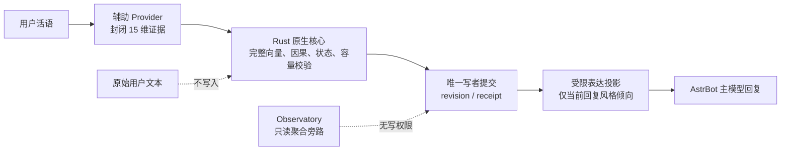
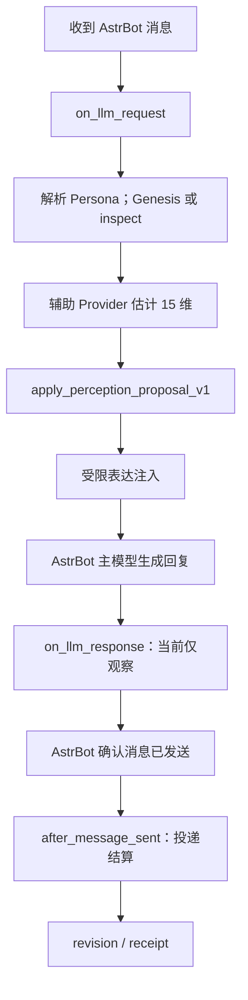

# AstrEmbodiment

让你的 Bot 不只记住经历，更能延续「Ta 是谁」。

AstrEmbodiment 是 AstrBot 的 Rust 原生人格连续性运行时：把当轮互动归约为可验证证据，以持久、可回放、受限的状态影响后续表达倾向，而不保存长期聊天正文。

> **用户话语 → 15 维闭合语义证据 → 原生状态原子提交 → 受限表达投影**（每次提交产生 `revision / receipt`，并按闭合因果规则处理。）

本仓库的产品版本合同是 `1.0.0`。版本合同不等于远端已经发布；只有当前正式流程的 release receipt、双平台 fresh build、allowlisted ZIP、SHA-256 与独立复核都成立时，具体制品才可被声称为可发布。

<p align="center">
  
</p>

<p align="center">
  
  =4.16,<5">
  
  
</p>



**A｜能力闭环。**辅助 Provider 只把当前请求归约为封闭的十五维证据，不能直接写神经状态；Rust 核心在验证完整向量、因果基线、状态与容量后，才是生产状态的唯一写者。原始用户文本不写入原生状态库。

**B｜人格连续性。**互动证据可以持续改变原生状态与后续表达倾向；这是可持久、可回放、受限的工程状态，插件升级后继续从持久化原生状态恢复，不等同于意识、主观感受或真实关系。

**C｜可观测证据。**每轮可以用 revision、receipt、去重状态、聚合维度与表达状态审阅闭环；Observatory 旁路只读，不能改写 SeedCode、revision 或神经节点。表达投影只影响当前回复的风格倾向，绝不替换主模型、事实、安全策略、工具策略或权限。

## 导航

- [它解决什么](#它解决什么) · [能力一览](#能力一览) · [十五维语义证据](#十五维语义证据)
- [一轮请求如何工作](#一轮请求如何工作) · [人格连续性、Genesis 与 SeedCode](#人格连续性genesis-与-seedcode) · [安装、升级与配置](#安装升级与配置)
- [Observatory](#observatory) · [架构地图](#架构地图) · [对接 API](#对接-api)
- [与 Sylanne 的关系](#与-sylanne-的关系) · [失败策略与兼容性](#失败策略与兼容性) · [文档导航与发布治理](#文档导航与发布治理)

## 它解决什么

普通“情绪标签”方案常停在“文本分类 → 标签 → prompt 语气”。AstrEmbodiment 的边界更窄也更可复核：语义层产生固定槽位的证据，Rust 原生运行时负责状态提交，AstrBot 只把受限投影带入当前回复。

因此，Bot 可以在经历后更稳定地表现出温度、谨慎、边界、修复取向或表达收束；但事实判断、安全策略、工具策略、权限与最终自然语言回复仍由 AstrBot 宿主和主模型决定。它不是聊天记录备份、RAG、独立模型、心理诊断或人格治疗工具。

## 能力一览

| 能力 | 当前产品边界 |
| --- | --- |
| Persona Genesis | 以有限 Persona 输入建立闭合身份起点。 |
| 统一辅助 Provider | `model_settings.assistant_provider_id` 同时服务辅助能力与本轮十五维估计；留空时使用当前会话 Provider。 |
| 十五维语义闭合 | 固定槽位与完整校验；自由文本不进入原生状态通道。 |
| Rust 原生连续体 | 固定规模节点场、原生计算与生产状态唯一写者。 |
| 因果 revision 与事件去重 | 过期或重复提交不能覆盖合法状态。 |
| 受限表达投影 | 聚合为 warmth、sensitivity、guardedness、repair orientation、engagement、epistemic caution 六项倾向。 |
| 持久人格连续性 | 普通重载与兼容升级恢复既有状态；显式重生另起当前代。 |
| 真实投递结算 | 只有 AstrBot 确认消息已经发送后才提交投递事实。 |
| 只读 Observatory | 输出 content-free 聚合观测，不具有状态写权限。 |

明确非目标：不保存长期聊天正文、摘要、embedding 或用户事实画像；不替换 AstrBot 的主对话模型、适配器、权限系统或安全策略；不提供主动消息、TTS、社交媒体发布、独立 HTTP 服务或独立 WebUI。

## 十五维语义证据

语义层只提交以下固定槽位；它们是对本轮互动的闭合证据，不是对用户或 Bot 心理状态的诊断。

| 键 | 中文含义 |
| --- | --- |
| `positive` | 正向、友好或肯定证据 |
| `affiliation` | 亲近、协作或关系靠近证据 |
| `harm` | 伤害、威胁或损害证据 |
| `boundary` | 边界触碰、越界或边界维护证据 |
| `repair` | 道歉、修复或缓和关系证据 |
| `repetition` | 重复请求、重复刺激或持续施压证据 |
| `new_information` | 新事实、新线索或信息增量证据 |
| `constraint_instability` | 约束冲突、要求漂移或规则不稳定证据 |
| `epistemic_conflict` | 事实判断、知识或可信度冲突证据 |
| `self_responsibility` | 用户对自身责任的承认或承担证据 |
| `other_responsibility` | 对他者责任的归因证据 |
| `hostility` | 敌意、攻击或对抗证据 |
| `publicness` | 公开场景、旁观压力或社会暴露证据 |
| `engagement` | 参与意愿、互动投入或持续交流证据 |
| `rejection` | 拒绝、排斥或中止互动证据 |

某一维为零，表示本轮评估为中性基线，并不等于原生节点未计算。单轮非零数量也不能被用来宣称 Bot 具有真实情感；神经传播与观测的工程边界见 [架构文档](docs/architecture/MVP_ARCHITECTURE.md) 和 [数据契约](docs/engineering/DATA_CONTRACTS.md)。

## 一轮请求如何工作



1. `on_llm_request` 冻结当前请求并解析有效 Persona；尚未建立身份时执行 Genesis，否则读取已有状态。
2. 辅助 Provider 将当前请求归约为十五维 proposal，严格校验后由 `apply_perception_proposal_v1` 请求原生提交。
3. 通过的受限表达投影被注入当前 `ProviderRequest`；AstrBot 主模型仍独立生成回复。
4. `on_llm_response` 当前只观察，不提交候选行动。平台确认真实发送后，`after_message_sent` 才结算投递事实并同步原生 revision。

整个路径是 in-process 插件调用：没有独立 HTTP 监听端口。

## 人格连续性、Genesis 与 SeedCode

同一 Bot/Persona 的持久数据目录保持不变时，普通插件重载或兼容升级会恢复既有状态。Genesis 建立身份起点；SeedCode 是身份连续性的指纹，不是密码、API 密钥或聊天记录备份。

在配置页**明确删除并保存**已有 `seed_code` 后，插件会在下一次安全检查时重生该人格的当前代建模/经历状态并生成新的 SeedCode，旧 generation 保留。字段缺失、默认空值、配置读取失败、迁移、普通更新或加载失败都不会触发重生；只有用户主动触发的重生/清空路径可以重新初始化，且失败时不得静默重生。

原生状态不保存长期聊天正文、摘要、embedding 或用户事实画像。它保存的是受限的连续体状态、journal/snapshot/delta、revision 与可回放所需的闭合记录。

## 安装、升级与配置

### 安装与升级

只安装来自当前正式 release 流程的可安装 ZIP：它必须包含 Windows x64 与 Linux x86_64 的 allowlisted runtime，并配套 SHA-256 与 receipt。不要把本地候选、CI 中间产物或单平台 wheel 当作正式制品。

升级前保留 AstrBot 分配的插件数据目录。若显式配置 `native_data_dir` 或 `continuity_vault_dir`，请持续使用同一路径；原生存储打开、回放或 revision 校验失败时应显式报告，不能静默清空。

### 配置字段

| 字段 | 默认值 | 作用与边界 |
| --- | --- | --- |
| `runtime_envelope` | `auto` | 选择运行资源包络，不改变身份公式或行为。 |
| `native_data_dir` | `""` | 原生核心数据目录；留空使用 AstrBot 为插件分配的目录。 |
| `continuity_vault_dir` | `""` | 可选既有 Vault 的绝对路径，末级须为 `continuity-vault`；不是新建身份入口。 |
| `observatory_enabled` | `true` | 控制成功时的一行中文简洁摘要；失败警告仍保留。 |
| `node_observability_detailed_logging` | `false` | 仅原生布尔 `true` 启用闭合 JSON 聚合观测，并覆盖成功简洁日志开关。 |
| `proactive_enabled` | `false` | 保留配置字段；当前未启用主动联系或消息投递。 |
| `model_settings.assistant_provider_id` | `""` | 统一辅助 Provider；留空使用当前会话 Provider。 |
| `model_settings.semantic_estimator_timeout_ms` | `8000` | 十五维估计的总时间预算，允许范围为 1000–15000 毫秒。超时不提交语义、不回退固定零值，也不尝试表达投影。 |
| `seed_code` | `""` | 当前原生身份种子；仅按上节所述的明确删空并保存语义处理。 |

`model_settings.semantic_estimator_provider_id` 和 `seed_mirror_guard_v1` 是迁移/内部字段，不应手动修改。

常用命令以 AstrBot 实际命令前缀为准：

```text
<命令前缀>ae
<命令前缀>ae_seed
```

- `ae`：查看原生核心版本、公式、节点容量与运行状态。
- `ae_seed`：查看或在 Genesis 成功后生成当前人格的 SeedCode。

## Observatory

Observatory 是只读的字段地图，不是调参或写状态入口。当前有两类彼此独立的输出：

- **节点运行观测。**`observatory_enabled=true`（且为原生布尔值）启用简洁模式，控制这类记录的成功简洁摘要；失败警告始终保留。该简洁摘要的字段地图包括十五维、confidence、base revision、revision、receipt/dedup、激活节点/边、残差与 expression 状态。`node_observability_detailed_logging=true`（且为原生布尔值）启用调试模式，把这类节点运行记录切换为闭合 JSON 聚合输出，并覆盖成功简洁日志开关。它不控制下述请求语义记录。
- **请求语义观测。**每次请求都会生成一条闭合的语义记录，不受上述两个开关控制。成功记录使用 INFO，降级或失败记录使用 WARN。语义估计超时、不可用或 malformed 时，本轮不提交语义、不回退固定零值，也不尝试表达投影，已有合法状态保持不变。

请求语义记录只展示字段类别；下例折叠了固定槽位和计数对象的内容（字段名与当前实现一致，数值仅示例）。相关数据契约见 [数据契约](docs/engineering/DATA_CONTRACTS.md)。

```json
{
  "schema": "astr-embodiment.semantic-observatory.v2",
  "status": "SUCCESS",
  "code": "SEMANTIC_COMMITTED",
  "expression_state": "APPLIED",
  "dimensions_fxp6": "15 个固定槽位的 fxp6 聚合",
  "estimator_confidence_fxp6": 800000,
  "revision": 42,
  "deduplicated": false,
  "semantic_vector_counts": "已命名的向量计数聚合",
  "node_counts": "已命名的节点计数聚合",
  "expression_profile_fxp6": "六项受限表达聚合",
  "transport_subcode": "NONE",
  "attempted": true,
  "attempt_count": 1
}
```

请求语义记录只包含聚合标量和稳定错误码：`dimensions_fxp6`、`estimator_confidence_fxp6`、revision、deduplicated、`semantic_vector_counts`、`node_counts`、`expression_profile_fxp6`、状态子码及 transport 元数据。不得记录用户正文、Provider 原始输出、身份 token、SeedCode、状态 digest、节点/边数组、端点、权重或拓扑。任一观测记录格式化失败时，输出固定安全失败记录，不回显原始异常载荷。

## 架构地图

| 层 | 职责 |
| --- | --- |
| AstrBot Host | 生命周期、Persona 解析、Provider 调用、上下文注入与真实投递回执。 |
| 语义闭合层 | 统一辅助 Provider、固定十五维 proposal 与严格 schema 校验。 |
| Rust 原生运行时 | Genesis、authority/causality、neurocontinuum、mechanics/renormalization 与 expression projection。 |
| Continuum Persistence | Journal、Snapshot/Delta、revision、replay 与唯一写者。 |
| Observatory/Safety | content-free 聚合投影、稳定错误码与只读安全边界。 |

详细的组件职责与数据形状分别见 [组件目录](docs/architecture/COMPONENT_CATALOG.md)、[数据契约](docs/engineering/DATA_CONTRACTS.md) 与 [资源包络](docs/engineering/RESOURCE_ENVELOPES.md)。

## 对接 API

当前对接是进程内接口，不是 HTTP API。README 只列出已经实现的入口类别；共享 API 头与 payload 细节以源码和数据契约为准。

- AstrBot hooks：`on_llm_request`、`on_llm_response`、`after_message_sent`；管理命令：`ae`、`ae_seed`。
- `NativeBridge` 身份与受控重生：`open`、`ensure_genesis`、`prepare_rebirth_v1`、`confirm_rebirth_v1`、`reconcile_seed_config_v1`、`ack_seed_config_writeback_v1`。
- `NativeBridge` 状态、检查与关闭：`apply_event`、`inspect`、`verify_replay`、`semantic_revision_v1`、`apply_perception_proposal_v1`、`health`、`close`。

接口只返回其契约许可的闭合数据；调用方不能用 Python 旁路改写生产状态、SeedCode 或 revision。

## 与 Sylanne 的关系

AstrEmbodiment 延续 Sylanne“让 Bot 持续成为自己”的产品方向，但使用独立的 Rust 原生状态模型。它不是 Sylanne 的 Rust 后端，不会自动读取 Sylanne Python 状态，也不会自动迁移 Sylanne 的长期记忆、关系状态、主动聊天、QQ 空间、TTS、Embedding 或独立 WebUI 数据。

可以继续使用 AstrBot Persona 迁移，但 AstrEmbodiment 会独立 Genesis 并生成自己的 SeedCode。两套人格运行时若同时作用于同一会话，可能发生上下文和投递结算冲突；部署时建议每个会话只启用一个。这是部署建议，不表示源码已强制互斥。

## 失败策略与兼容性

| 情形 | 策略 |
| --- | --- |
| 原生扩展缺失或平台不受支持 | 拒绝把 Python 当作默认大脑。 |
| Genesis 或身份回执无效 | 停止该请求路径，不制造默认人格或伪造 SeedCode。 |
| 语义估计不可用或 malformed | 本轮不提交语义状态，不回退固定零值，也不尝试表达投影。 |
| 原生 schema、state、revision 或 capacity 校验失败 | 拒绝本轮提交并保留已有合法状态。 |
| stale/duplicate 事件 | 按闭合因果和幂等语义处理，不重复改变状态。 |
| 消息未真实投递 | 不提交对应投递事实。 |
| Observatory 格式化失败 | 输出固定安全失败记录，不回显原始异常载荷。 |

兼容性合同：AstrBot `>=4.16,<5`；CPython `>=3.12`，原生制品目标为 abi3；当前 metadata 支持适配器为 `aiocqhttp`；正式原生平台目标为 Windows x64 与 Linux x86_64。不承诺 macOS、ARM、musl-only Linux 或未列出的适配器。

## 文档导航与发布治理

- 产品：[`PRODUCT_COPY.md`](docs/product/PRODUCT_COPY.md)、[`MVP_SCOPE.md`](docs/product/MVP_SCOPE.md)
- 架构：[`MVP_ARCHITECTURE.md`](docs/architecture/MVP_ARCHITECTURE.md)、[`COMPONENT_CATALOG.md`](docs/architecture/COMPONENT_CATALOG.md)
- 工程：[`DATA_CONTRACTS.md`](docs/engineering/DATA_CONTRACTS.md)、[`REPOSITORY_MAP.md`](docs/engineering/REPOSITORY_MAP.md)、[`RESOURCE_ENVELOPES.md`](docs/engineering/RESOURCE_ENVELOPES.md)、[`VERIFICATION_GAUNTLET.md`](docs/engineering/VERIFICATION_GAUNTLET.md)
- 理论：[`FORMULA_PROFILE.md`](docs/theory/FORMULA_PROFILE.md)
- 变更与许可证：[`CHANGELOG.md`](CHANGELOG.md)、[`LICENSE`](LICENSE)

发布治理不写虚构下载链接、Release URL、Marketplace 状态或测试徽章。

## 许可证

AstrEmbodiment 使用 [GNU AGPL-3.0-or-later](LICENSE) 发布。
