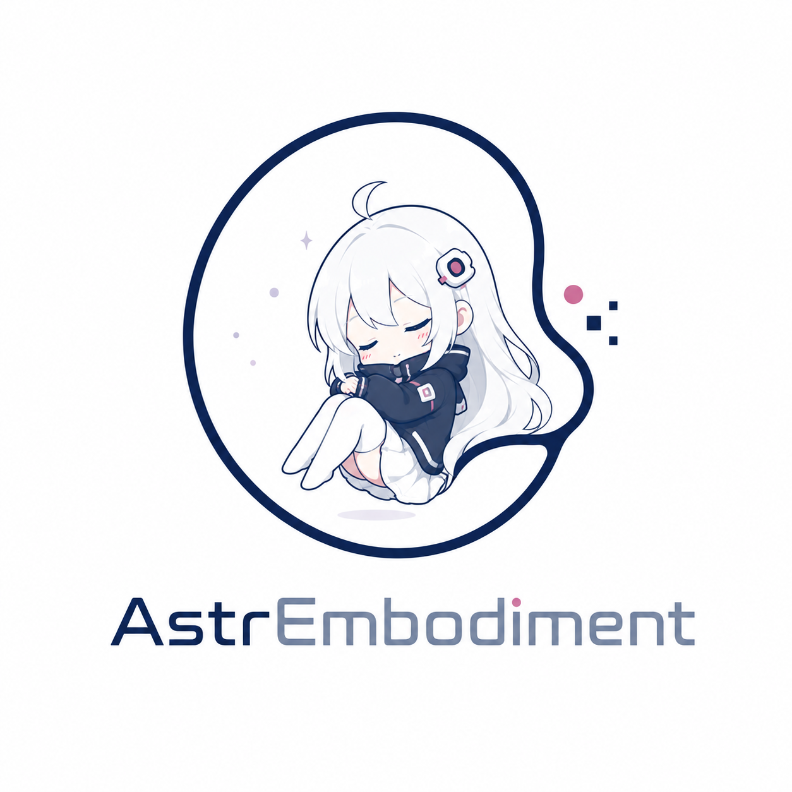
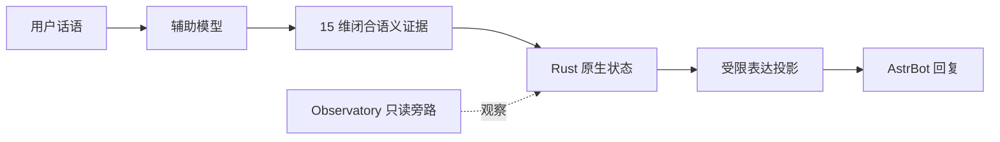

# AstrEmbodiment

让你的 Bot 不只记住经历，更能延续「Ta 是谁」。

  

  
  =4.16,<5">
  
  

AstrEmbodiment 是面向 AstrBot 的 Rust 原生人格连续性运行时。它把当轮互动转化为可验证的语义证据，持续影响后续表达倾向，同时不保存长期聊天正文；当前正式版为 **1.0.0**。

它以 Rust 原生状态、15 维闭合语义证据和受限表达投影来工作。AstrEmbodiment 不替换 AstrBot 的主模型、事实判断、安全策略、工具策略或权限；它为已有对话能力提供持续而克制的表达上下文。

## 安装

| 要求 | 说明 |
| --- | --- |
| AstrBot | `>=4.16,<5` |
| 平台 | Windows x64 与 Linux x86_64 |
| 适配器 | 当前支持 `aiocqhttp` |

1. 打开 AstrBot WebUI，进入“插件管理 → 插件市场”，搜索 **AstrEmbodiment**。
2. 确认作者为 **2718labs** 后安装并启用插件；插件市场会完成兼容包下载。
3. 升级时保留 AstrBot 分配的插件数据目录；若使用自定义目录，请继续沿用原路径。

## 快速开始

1. 在插件配置页选择“辅助模型 Provider”；留空时使用当前会话 Provider。
2. 保存配置并开始一次正常对话；首次使用会建立当前 Persona 的 Genesis 与 SeedCode。
3. 使用 `<命令前缀>ae` 查看运行状态与当前原生运行时信息。
4. 使用 `<命令前缀>ae_seed` 查看或生成当前人格的 SeedCode。

完成后，Bot 会在正常对话中逐步形成受限的表达倾向。无需为每次消息手动打标签，也无需迁移或上传历史聊天记录。

## 核心能力

### A｜能力闭环

**用户话语 → 15 维闭合语义证据 → 原生状态原子提交 → 受限表达投影**。

辅助模型负责理解当轮互动，Rust 原生核心负责验证和提交。通过验证的投影只影响当前及后续回复的风格倾向，例如更温和、更谨慎或更重视边界；它不会替主模型作出事实判断或调用工具。

当辅助模型较慢时，主对话会在短暂等待后继续，语义处理转入受限的持久后台任务。未完成的结果不会伪装成本轮已经应用的表达投影，后续也只会使用经过验证的状态。

### B｜人格连续性

同一 Persona 的互动经历保存在持久化原生状态中。普通重载以及**插件升级后继续从持久化原生状态恢复**，因此不必依赖长期聊天正文来维持表达一致性。

SeedCode 是人格连续性的身份标记，不是密码、API 密钥或聊天记录。需要重新开始时，明确删空 SeedCode 并保存即可触发受控重生；普通升级、重载或配置读取异常不会自动重置人格。

这是一种受限、可回放的工程状态，**不等同于意识、主观感受或真实关系**。它不会将 Bot 描述为具有真实情感，也不保存用户画像。

### C｜可观测性

管理员可以查看运行状态、修订进展和聚合诊断。**简洁模式**适合日常运行时的一行摘要；**调试模式**提供结构化的聚合信息，便于定位配置和运行问题。

Observatory 是只读旁路，不能改变生产状态。无论使用哪种模式，都不会记录用户正文、Provider 原始输出、SeedCode 或内部神经拓扑。

## 15 维语义证据

15 维证据描述的是“这一轮互动呈现了什么信号”，不是对用户或 Bot 的心理诊断，也不是一份可长期保存的聊天档案。每个维度使用受限值表达强弱，未出现的信号保持中性。

| 维度 | 面向互动的含义 |
| --- | --- |
| `positive` | 友好、肯定或积极反馈 |
| `affiliation` | 亲近、协作或关系靠近 |
| `harm` | 伤害、威胁或损害线索 |
| `boundary` | 边界触碰、越界或边界维护 |
| `repair` | 道歉、修复或缓和互动 |
| `repetition` | 重复请求、重复刺激或持续施压 |
| `new_information` | 新事实、新线索或信息增量 |
| `constraint_instability` | 要求冲突、规则漂移或约束不稳定 |
| `epistemic_conflict` | 事实判断、知识或可信度冲突 |
| `self_responsibility` | 对自身责任的承认或承担 |
| `other_responsibility` | 对他者责任的归因 |
| `hostility` | 敌意、攻击或对抗 |
| `publicness` | 公开场景、旁观压力或社会暴露 |
| `engagement` | 参与意愿和持续交流投入 |
| `rejection` | 拒绝、排斥或中止互动 |

这些证据由辅助模型归纳，再由原生核心校验；自由文本不会直接进入原生状态。各维度的数据形状与边界见[数据契约](docs/engineering/DATA_CONTRACTS.md)。

## 工作原理

每次对话先在当前 Persona 下读取已有状态，再对本轮互动进行受限语义归纳。只有符合闭合语义要求的证据才会更新原生状态；AstrBot 的主模型仍独立生成最终回复。

这种设计让持续性来自可控状态，而非把聊天正文、摘要、embedding 或用户事实画像当作长期记忆保存。它也不提供主动消息、TTS、社交媒体发布、独立 WebUI 或 HTTP 服务。

## 人格连续性与 SeedCode

Genesis 为 Persona 建立初始身份状态，SeedCode 用于标识同一连续人格。它能帮助管理员确认当前对话使用的是哪个身份，而不会暴露聊天内容。

保留插件数据目录即可在日常重载和升级后恢复原有状态。若确实需要为某个 Persona 开启新的经历轨迹，请在配置中明确清空 SeedCode 并保存；这会启动新的受控重生流程。

不要通过删除插件数据目录来“修复”问题。这样会丢失既有状态，也会让后续诊断缺少必要上下文；优先确认数据目录路径和插件配置是否保持不变。

## 常用配置

| 配置 | 使用说明 |
| --- | --- |
| 辅助模型 Provider | 选择语义估计所用 Provider；留空使用当前会话 Provider。 |
| 运行资源档位 | 默认 `auto`；仅资源受限环境需要调整。 |
| 只读诊断 | 默认开启简洁模式；调试模式仅输出聚合信息。 |
| 原生数据目录 | 默认使用 AstrBot 分配目录；自定义后升级时保持路径不变。 |
| SeedCode | 通常无需手动修改；明确删空并保存会触发受控重生流程。 |

这些配置面向部署与日常管理。完整配置范围和默认值请参阅 [`_conf_schema.json`](_conf_schema.json)；二次开发时请以数据契约和源码为准。

## 可观测性与隐私

简洁模式提供适合日常查看的一行运行摘要。调试模式提供结构化聚合信息，以便管理员了解语义处理与状态进展；两种模式都没有状态写入权。

原始用户文本不会写入原生状态库。日志和 Observatory 不包含用户正文、Provider 原始输出、SeedCode、节点/边数组、权重或拓扑，因此可用于运维观察而不复制对话内容。

若语义处理尚未在前台完成，AstrEmbodiment 会让主对话继续，并在后台完成受限处理。已有合法状态会继续保留，不会为了填补等待而制造新的语义结果。

## 兼容性与限制

| 项目 | 支持范围 |
| --- | --- |
| AstrBot | `>=4.16,<5` |
| 原生平台 | Windows x64 与 Linux x86_64 |
| 适配器 | `aiocqhttp` |

未列出的系统架构不在支持范围内。AstrEmbodiment 不保存长期聊天正文，不替换 AstrBot 的主模型、安全策略、工具策略或权限，也不提供独立 WebUI 或 HTTP 服务。

## 常见问题

### 插件没有加载？

请确认插件已经启用，再检查 AstrBot 版本、操作系统和 CPU 架构是否位于支持范围内。

### 为什么本轮没有立刻看到语义结果？

辅助模型可能已转入后台处理。主对话不会因等待 Provider 而长期阻塞，后台结果只会在完成验证后影响后续表达。

### 升级后状态异常怎么办？

先确认插件数据目录没有改变，并检查自定义目录配置是否仍指向原路径。不要通过删除目录来“修复”，以免丢失既有连续状态。

## 开发者资料

- [架构概览](docs/architecture/MVP_ARCHITECTURE.md)
- [组件目录](docs/architecture/COMPONENT_CATALOG.md)
- [数据契约](docs/engineering/DATA_CONTRACTS.md)
- [资源包络](docs/engineering/RESOURCE_ENVELOPES.md)
- [变更记录](CHANGELOG.md)

二次开发请以源码、数据契约与**共享 API 头**为准；README 不承诺未公开的内部接口。

## 许可证

AstrEmbodiment 使用 [GNU AGPL-3.0-or-later](LICENSE) 发布。
