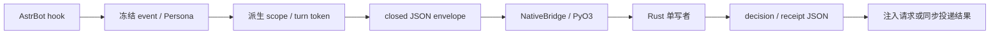
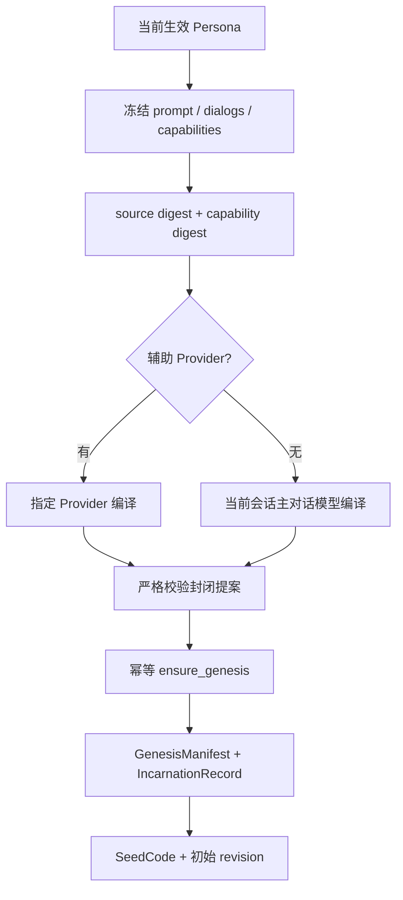
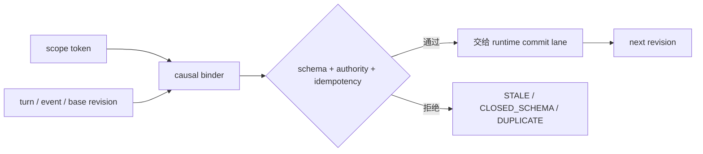
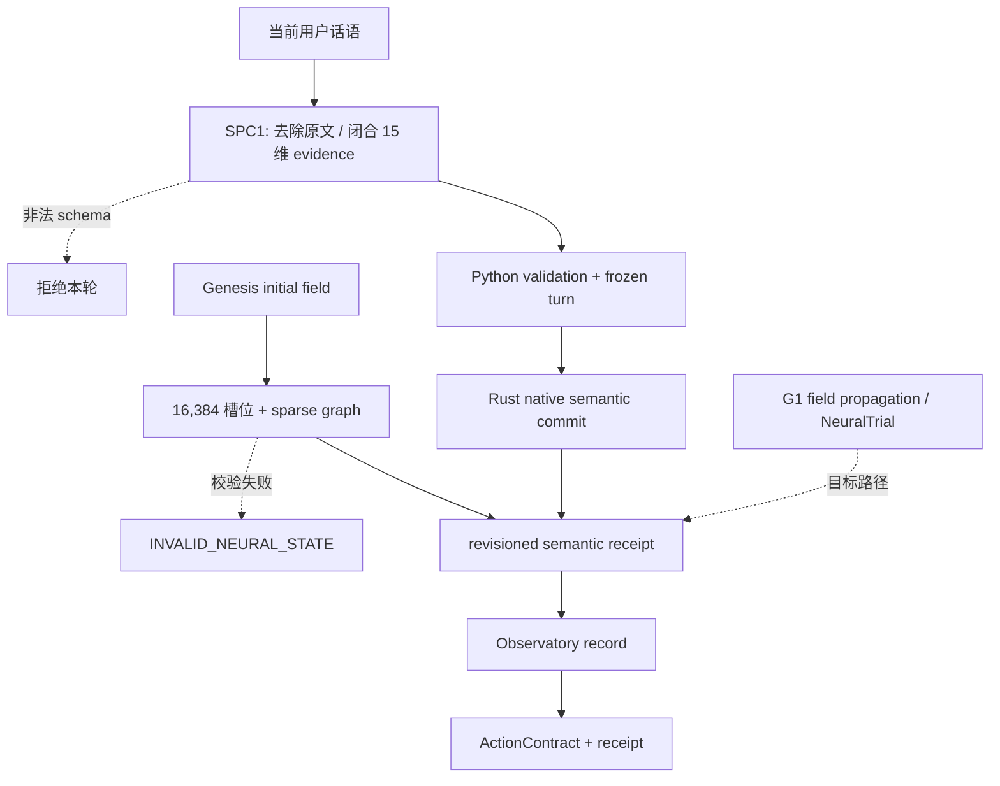
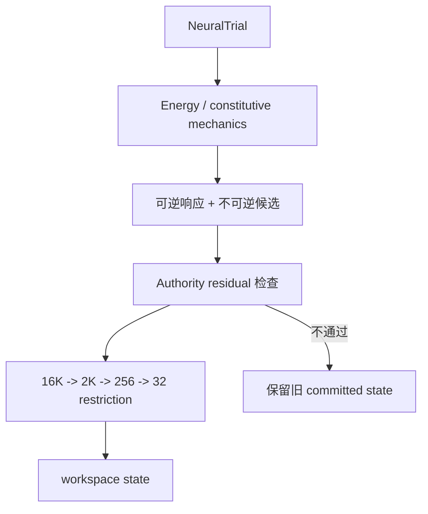
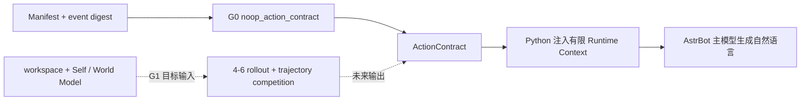
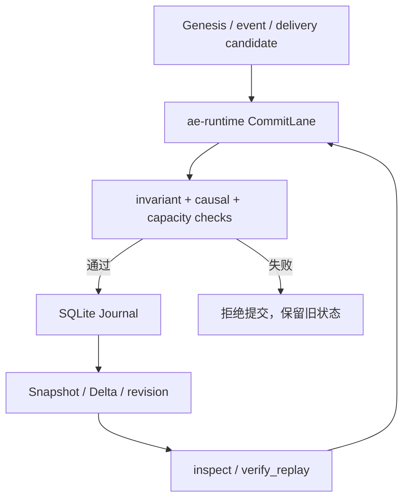
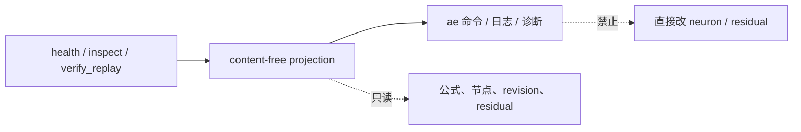
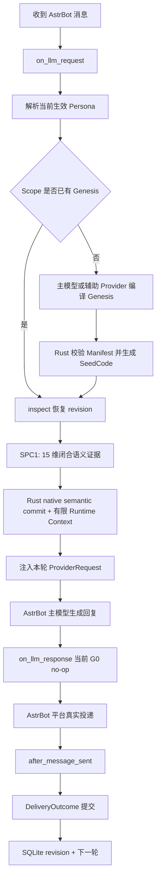

# 让你的 Bot 不只记住经历，更能延续「Ta是谁」

**用户话语 → 15 维闭合语义证据 → native semantic commit**

AstrEmbodiment 是为 AstrBot 构建的 Rust 原生人格连续性运行时。它为人格建立可验证的 Genesis 起点和可持久的 SeedCode，并让每次进入状态的语义变化都能被验证、提交和追溯。

它正在回答一个比“记住了什么”更难的问题：同一个 Bot，如何在一次次相处之后，仍然能够确认自己是谁、经历了什么，以及哪些变化真正属于自己。

<p align="center">
  
</p>

<p align="center">
  <strong>Rust 原生人格连续性运行时</strong><br>
  用 Genesis、SeedCode、闭合语义证据与原生提交，给“持续成为自己”一条可验证的路径。
</p>

<p align="center">
  
  =4.16,<5">
  
  
</p>

<p align="center">
  <a href="#为什么是人格连续性">为什么</a> · <a href="#现在已经能做什么">能力</a> · <a href="#快速开始">快速开始</a> ·
  <a href="#一次互动如何进入连续性">工作流</a> · <a href="#observatory看见每次提交了什么">Observatory</a> · <a href="#当前能力边界">边界</a> ·
  <a href="#模块分层">技术细节</a> ·
  <a href="CHANGELOG.md">更新记录</a>
</p>

> **当前版本：1.0.0-rc1 本地候选。** Genesis、SeedCode、G0 continuity 与 SPC1 semantic commit 已接线并通过本地候选验收；受控回应策略和人格漂移仍是后续能力。尚未创建 GitHub Release，也未上架 AstrBot Marketplace。

## 为什么是人格连续性

记忆回答“发生过什么”；人格连续性还要回答：这些经历是否属于同一个持续存在的 Bot。Persona prompt 可以描述一个角色，却不能单独提供可修订、可持久、可验证的身份路径。

AstrEmbodiment 把这条路径收拢为一个闭环：Genesis 定义起点，SeedCode 固定身份，闭合语义证据描述本轮输入的可提交部分，Rust 单写者负责原生状态与回执。它不替代 AstrBot 的主对话模型，而是让模型的上下文有一条可审计的连续性基础。

## 现在已经能做什么

| 当前能力 | 它为用户带来的结果 |
| --- | --- |
| Genesis + SeedCode | 为同一个 Persona/Scope 建立并保留可验证的运行身份；重载后仍可确认“是不是同一个自己”。 |
| G0 continuity | 为 revision、replay、生命周期与真实投递事实建立受控边界，拒绝过期或重复提交。 |
| SPC1 语义证据 | 将当前用户话语估计为 15 维已验证的闭合语义证据；原生状态不保留原始文本。 |
| native semantic commit + Observatory | 由 Rust 权威提交语义提案，并用不含消息内容的本地结构化日志展示结果。 |

## 一次互动如何进入连续性

当前已接线的路径是：

```text
current user text
  -> closed 15-dimensional semantic evidence
  -> Python validation and frozen turn binding
  -> Rust native semantic commit
  -> revisioned receipt and local observatory record
```

这条路径已经能把本轮语义以受控、可验证的方式带入连续性状态。它与未来的受控回应策略、外显人格漂移是两层能力：前者已经可以提交，后者还不能据此宣称会改变 Bot 的对外人格。

## 快速开始

### 安装本地 RC1 发布包

使用已完成本地验收的 `astrbot_plugin_astrembodiment-1.0.0-rc1-win_linux_x86_64.zip`，解压到 AstrBot 的插件目录，然后重载插件。该归档尚未作为 GitHub Release 发布，也未上架 AstrBot Marketplace。

首次载入后，可使用：

```text
<命令前缀>ae
<命令前缀>ae_seed
```

- `ae`：显示原生核心版本、公式、节点数量和运行状态。
- `ae_seed`：已有 SeedCode 时回显；没有时执行 Genesis、生成并保存新的身份种子。

### 关键配置

| 字段 | 默认值 | 作用 |
| --- | --- | --- |
| `native_data_dir` | `""` | 原生 SQLite 数据目录；留空时使用 AstrBot 分配的插件数据目录。 |
| `model_settings.assistant_provider_id` | `""` | Genesis 辅助模型 Provider ID；留空时使用当前会话的主对话模型。 |
| `observatory_enabled` | `true` | 开启不含消息正文的 SPC1 结构化诊断日志。 |

配置由 AstrBot 根据 `_conf_schema.json` 管理。没有 WebUI 时，请在 AstrBot 的插件配置文件中修改这些字段，而不要修改发布包内的插件目录。

## Observatory：看见每次提交了什么

SPC1 的本地观测记录会在普通日志级别给出完整结果：SUCCESS 和 NOOP 以 INFO 记录；DEGRADED 以 WARNING 记录。只要估计有效，记录会包含全部 15 个 fxp6 语义证据值和置信度，并清楚区分已提交、已估计但未提交、已估计但未确认，以及不可用。原生回执可信时，`calculation_state=CONFIRMED`，`native_calculation` 会继续给出 `state_changed`、`active_nodes`、`active_edges` 和五类 `residuals_fxp6`；未进入原生计算时为 `NOT_ATTEMPTED`，进入后未取得可信回执时为 `UNCONFIRMED`。

当前 RC1 的原生 load 直接使用 `positive`、`harm`、`boundary` 和 `epistemic_conflict` 四个维度；其余维度仍作为同一份闭合证据被验证、记录和随回执追溯。这里的 15 个值是语义证据，不是可由外部直接编辑的“神经节点”。

Observatory 不记录用户消息、Provider 输出、token、nonce、SeedCode、状态 digest 或原始神经节点；它只回显闭合的估计输入、原生计算摘要和提交结论，帮助你判断本轮算了什么、是否提交，以及为什么没有抵达。

## 当前能力边界

AstrEmbodiment 今天可以将闭合语义证据提交到原生状态，但不把这等同于完整的情绪反应产品。受控回应策略和外显人格漂移仍是后续能力；当前版本不会据此承诺改变 Bot 的对外语言、关系策略或长期行为。

Sylanne 的长期记忆、关系状态、主动聊天、TTS 与 dashboard 等产品能力没有捆绑进 AstrEmbodiment。两者都可能接管同一轮对话的生命周期，因此同一个 AstrBot 会话只应启用一个人格运行时。

## 模块分层

这里不把模块压缩成一张职责表，而是按“谁接收什么、处理什么、能写什么”展开。AstrBot 适配层负责宿主边界；Rust 原生层负责连续体状态；模型与验证层负责固定公式、资源包络和发布门禁。

**宿主适配层**：`main.py` 注册 Star、命令和三个生命周期钩子；`astr_embodiment/persona_genesis.py` 冻结 Persona 并校验 Genesis 提案；`astr_embodiment/coordinator.py` 合并同一 Scope 的并发 Genesis；`astr_embodiment/bridge.py` 通过 PyO3 调用原生核心；`astr_embodiment/contracts.py` 定义 Scope、事件、`ActionContract` 和 `DeliveryOutcome`；`astr_embodiment/tokens.py` 派生不可逆 token。

**原生加载与模型配置**：`python/astrembodiment_core/` 按内容寻址加载 Windows/Linux 扩展；`model/formula-v1.toml` 固定人格公式和 16,384 槽位；`model/runtime-1c1g.toml` 约束线程与内存预算；`model/authority-matrix-v1.toml` 规定权限残差；`model/regions-v1.toml` 规定神经场区域布局。

**Rust 原生 crate**：`ae-pyo3` 暴露 Python 边界；`ae-runtime` 是唯一提交写者；`ae-store` 保存 SQLite Journal 和 Snapshot；`ae-authority` 处理权限与因果；`ae-attention`、`ae-neurofield`、`ae-mechanics`、`ae-renorm` 和 `ae-agent` 依次处理荷载、神经场、候选响应、尺度投影和行动契约；`ae-continuum` 负责 Delta 与 replay。

**验证与打包**：`tests/` 覆盖运行时、静态契约和归档检查；`scripts/package_plugin.py` 用 fresh 原生构建组装跨平台发布包；`.github/workflows/ci.yml` 执行 schema、metadata、Python 编译和发布门禁；`docs/` 与 `adr/` 保存架构决策、数据契约和产品边界。
### 模块之间的边界

Python 只负责 AstrBot 生命周期、Persona 快照、模型调用和消息投递。神经状态、残差、SeedCode 的权威生成和 SQLite 提交都由 Rust 单写者负责；Python 不能逐节点读写生产状态。

## 模块工作流

下面每个模块都是一个独立小节：先说明职责和输入输出，再给出自己的 Mermaid 工作流图。图中标注“G0 占位”或“目标路径”的地方，是为了区分当前 `1.0.0-rc1` 已接线行为和后续架构，不把设计稿误写成已完成能力。它们不代表插件额外开启了 HTTP 服务；当前插件仍由 AstrBot 生命周期驱动。

### 1. Host 与 FFI：把 AstrBot 事件变成封闭调用

宿主适配层只做生命周期、Persona 解析、模型调用和消息投递。输入是 AstrBot event、当前 Persona 和会话上下文；输出是封闭 JSON、有限 `ActionContract` 和投递回执。原始平台 ID 在进入 Rust 前先派生为不可逆 token；它只有“请求 Rust 提交”的权限，没有神经状态写权限。当前实现路径是 `ensure_genesis`、`apply_event`、`inspect` 和 `flush_and_close`，桥接失败时返回明确错误并让宿主继续自己的处理。



失败边界是封闭契约、原生核心不可用或 Scope 不一致；这些情况只会产生错误码/日志，不会让 Python 旁路修改 SQLite、SeedCode 或神经状态。

### 2. Persona Genesis：第一次成为“她”

Genesis 是一次性的身份建立过程。输入是当前生效 Persona 的有限字段、来源摘要和可选辅助 Provider；输出是封闭 Genesis 提案、Manifest、Incarnation、SeedCode 和初始 revision。`ensure_genesis` 本身是幂等的：已有已提交 Genesis 时会复用原始回执，只有首次成功才建立 Manifest、Incarnation 和 revision 0。编译模型不能看到当前用户原文，也不能直接生成 SeedCode；Rust 拥有身份提交写权限，Python 只负责编译、缓存回执和保存 SeedCode。Provider 无效、提案不完整、重试失败或身份不一致时返回错误并停止本轮。



输出是封闭 Genesis 提案、Manifest、Incarnation 和由 Rust 生成的 SeedCode。编译失败、schema 不完整、Provider ID 无效或身份回执不一致时返回 `GENESIS_UNAVAILABLE`/`GENESIS_MANIFEST_MISMATCH`，本轮停止，不创建默认人格，也不伪造 SeedCode。

### 3. Authority 与 Causality：谁有资格改变什么

这个模块不决定语气，而是决定一条事件是否有资格进入当前运行范围。输入是 Scope、Turn、Event、事件类型和 `base_revision`；输出是可交给单写者的提交候选或稳定错误码。它本身没有写权限，只负责检查 scope、schema、权限矩阵、事件唯一性和因果基线。



通过的事件也只是候选，最终仍要经过 Rust 唯一提交写者。任何 stale turn 或 stale base 都不能借用最新 revision 强行提交；失败时返回 `STALE_CAUSAL_BASE`、`STALE_REVISION`、`DUPLICATE_EVENT` 或 `CLOSED_SCHEMA`，并保留旧状态。

### 4. Micro-Attention 与 Neurocontinuum：从证据到原生语义提交

SPC1 当前输入是本轮用户话语生成的封闭 15 维语义证据和置信度；原始文本不会进入 native state。Python 先验证 schema、fxp6 维度与冻结 turn，再由 Rust 执行 semantic proposal commit。`ae-attention` 只有证据装配权限，`ae-neurofield` 负责建立、校验和摘要初始场，二者没有权威状态写权限；schema、维度、容量或神经状态校验失败时拒绝事件并保留 committed state。当前 RC1 的 native load 直接使用 `positive`、`harm`、`boundary` 与 `epistemic_conflict`；更深的场传播、Allostasis/Glia 与 `NeuralTrial` 仍属于后续 G1 路径。



### 5. Mechanics：把试算变成可检查的响应候选

目标输入是 NeuralTrial，目标输出是本构候选、残差检查和 16K -> 2K -> 256 -> 32 workspace；当前 `ae-mechanics`、`ae-renorm` 仅提供数据结构/纯函数占位，尚未接入 G0 runtime。它们即使产生候选也没有提交写权限，只有 `ae-runtime` 能落 Journal；残差或容量检查失败必须保留旧 committed state。



`ae-mechanics` 只产生 candidate，`ae-renorm` 只做尺度变换；只有后续的 `ae-runtime` 才能提交。

### 6. Agent Cognition：产生行动契约，而不是替模型说话

目标输入是 workspace 和边界，目标输出是少量 rollout 竞争后的 ActionContract；当前 `ae-agent` 只生成确定性的 scaffold/no-op contract，未实现 Self/World Model 或 4--6 条 rollout，且 Python 的 `on_llm_response` 当前是 no-op。该模块不会发送消息、没有平台写权限；契约 schema 或权限检查失败时由 runtime 拒绝，不直接影响已提交状态。



主模型仍是 AstrBot 的 Provider；AstrEmbodiment 只提供“本轮应该遵守的边界和节奏”，不替换 Provider。

### 7. Continuum Persistence：唯一写者和可回放状态

输入是 Genesis、UserStimulus 和 `DeliveryOutcome` 候选，输出是 SQLite Journal、Snapshot/Delta、revision、inspect 和 replay 报告。`ae-runtime` 是唯一提交写者，`ae-store` 负责 SQLite；Python 只能读取投影。因果、容量、状态或存储检查失败时不推进 revision；`after_message_sent` 只有确认真实投递后才提交 DeliveryOutcome。



`after_message_sent` 产生的 `DeliveryOutcome` 是交付事实；未真实投递的草稿不会写入行动所有权。

### 8. Observatory 与 Safety：只读看见，不从旁路改脑

输入是 `health`、`inspect`、`verify_replay` 的只读请求，输出是版本、公式、节点数、revision、residual 和 replay 状态等 content-free 投影。观测命令和未来管理页面均无神经、SeedCode 或 committed revision 写权限；核心关闭、scope 未绑定或 replay 不一致时返回稳定错误，不通过旁路修复状态。



禁止通过命令或未来的管理页面直接编辑单个神经元、残差、SeedCode 或 committed revision。

## 双向对接 API

### 先说明边界

当前发布版**没有独立 HTTP 监听端口**，也没有可直接暴露到公网的 REST API。对接方应通过 AstrBot 插件钩子或 Python `NativeBridge` 调用；下面的“请求头”是双向逻辑接口头，便于未来用 HTTP、IPC 或其他宿主桥接时保持契约一致，不代表当前已经存在 `/api/...` 路由。

### 逻辑请求头

请求头字段对应当前 `contracts.py` 的封闭 JSON 字段。HTTP/IPC 适配器应原样保留这些字段，不要把 SeedCode 当作认证密钥。

| 逻辑头 | 必填 | 示例 | 作用 |
| --- | --- | --- | --- |
| `X-AE-Schema` | 是 | `astr-embodiment.event.v1` | 契约版本；未知版本必须拒绝。 |
| `X-AE-Operation` | 是 | `apply_event` | `ensure_genesis`、`apply_event`、`inspect`、`verify_replay` 或 `flush_and_close`。 |
| `X-AE-Scope` | 是 | `scope-digest` | `bot_token/persona_token/session_token/relation_token` 的规范摘要，不传原始平台 ID。 |
| `X-AE-Turn` | 事件必填 | `turn-token` | 当前回合的不可逆 turn token。 |
| `X-AE-Event` | 事件必填 | `event-token` | 幂等事件 ID；重试必须复用同一值。 |
| `X-AE-Base-Revision` | 变更必填 | `42` | 事件读取的因果基线；过期时返回 `STALE_CAUSAL_BASE`。 |
| `X-AE-Idempotency-Key` | 变更必填 | `turn-token:event-token` | 防止重复 Genesis、刺激或投递提交。 |
| `X-AE-Trace` | 推荐 | `trace-token` | 只用于串联 AstrBot 日志，不进入神经状态。 |
| `Content-Type` | 有载荷必填 | `application/json` | 载荷必须是 UTF-8 canonical JSON。 |

### Python -> Rust：请求载荷

当前 Python 桥对应以下粗粒度方法：

| 方法 | 载荷 | 返回 |
| --- | --- | --- |
| `ensure_genesis(closed_request)` | `schema`、Persona 来源摘要、能力摘要、scope 和编译提案。 | `GenesisManifest`、`IncarnationRecord`、`seed_code`、`revision`。 |
| `apply_event(scope, event)` | `kind`、`payload.event_id`、`payload.scope`、`payload.causal`、封闭 evidence。 | `ActionContract`、`turn_id`、`seed_code`、`revision`、状态投影。 |
| `inspect(scope)` | 只读 scope。 | 当前绑定、revision、SeedCode 摘要和健康投影。 |
| `verify_replay(scope)` | 只读 scope。 | replay 是否一致及 content-free 校验结果。 |
| `flush_and_close()` | 无。 | 无；失败必须显式返回错误。 |

事件载荷的最小形状：

```json
{
  "kind": "delivery_outcome",
  "payload": {
    "event_id": "opaque-event-token",
    "scope": {
      "bot_token": "32-hex",
      "persona_token": "32-hex",
      "relation_token": null,
      "session_token": "32-hex"
    },
    "causal": {
      "turn_id": "32-hex",
      "action_id": null,
      "delivery_id": null,
      "claim_id": null,
      "base_revision": 42
    },
    "delivered": true,
    "visible_action_digest": "64-hex",
    "delivered_at_ms": 1760000000000
  }
}
```

### Rust -> Python：响应载荷

响应必须保留原生方法的 `schema` 和操作专用字段。`apply_event` 当前返回 `contract`、`receipt`、`revision`、`deduplicated`；`ensure_genesis` 当前返回 `lease_status`、`receipt`、`manifest`、`seed_code`、`seed_code_short`、`incarnation_id`；`inspect` 和 `verify_replay` 返回各自的只读投影。适配器可以在外层增加 `status` 和 `error`，但不能删除这些原生字段。

```json
{
  "schema": "astrembodiment.decision.v1",
  "contract": {},
  "receipt": {},
  "revision": 43,
  "deduplicated": false
}
```

Genesis 成功回执的外层形状为 `astrembodiment.genesis-receipt.v1`，其中 `seed_code` 只用于身份展示和配置持久化，不能当作认证头。错误使用稳定机器码：`GENESIS_UNAVAILABLE`、`RETRY_WAIT`、`GENESIS_REQUIRED`、`GENESIS_MANIFEST_MISMATCH`、`CLOSED_SCHEMA`、`UNSUPPORTED_EVENT`、`STALE_REVISION`、`STALE_CAUSAL_BASE`、`DUPLICATE_EVENT`、`LEASE_CONFLICT`、`LEASE_IN_FLIGHT`、`SEED_DIGEST_COLLISION`、`IDENTITY_MISMATCH`、`CLOSED`、`INVALID_NEURAL_STATE` 和 `STORAGE`。对接方应按错误码处理，不能通过字符串猜测错误类型，也不能在失败后自行修改状态。

## 一轮请求工作流



```text
收到消息
  -> on_llm_request
  -> 解析当前会话有效 Persona
  -> Genesis（若该 scope 尚未绑定）
  -> Rust inspect 持久化 revision
  -> SPC1 生成并验证 15 维闭合语义证据
  -> Rust native semantic commit
  -> 返回 ActionContract、回执与 SeedCode
  -> 注入本轮有限 Runtime Context
  -> AstrBot 主模型正常生成回复
  -> on_llm_response（当前 G0 no-op）
  -> after_message_sent 确认真实投递
  -> Rust 提交 DeliveryOutcome 并回写 revision
  -> 下一轮按同一 scope/revision 继续
```

插件重载后，Python 会从 native SQLite 恢复 revision，并让 turn 序号不低于持久化 revision。这样不会复用旧 turn ID，也不会再次提交过期的因果基线。

## Genesis 与 SeedCode

Genesis 只读取当前 AstrBot Persona 的有限字段：系统提示词、开场对话、情绪模仿对话、能力范围和错误提示。编译模型只输出封闭的低维初始表型；它不能设计神经拓扑、关系历史、用户事实、SeedCode 或权限。

Rust 验证并提交 GenesisManifest、IncarnationRecord 和 SeedCode。SeedCode 是身份指纹，用于确认同一 scope 的连续性；它不是密码，也不能解密或恢复聊天内容。

## AstrEmbodiment 与 Sylanne 的关系

AstrEmbodiment 是 `astrbot_plugin_sylanne` 的重制版和替代路线：保留 Sylanne 最初“让 Bot 成为一个持续存在的自己”的核心方向，但采用完全不同的 Rust 原生状态模型。它不是 Sylanne 的 Rust 后端，也不读取 Sylanne 的内部 Python 模块。

Sylanne 拥有更多面向产品体验的功能，例如长期记忆、关系状态、即时聊天、主动消息和 WebUI；AstrEmbodiment 刻意不包含这些扩展，只把人格连续性这条最核心的链路做成 Genesis、SeedCode、revision 和真实投递结算。

两者都注册 LLM 请求、响应和发送后的钩子，可能同时修改上下文或争夺投递结算权。因此它们不是可叠加组件：**同一个 AstrBot 会话只启用一个人格运行时**。使用 AstrEmbodiment 时请停用 Sylanne；不要让两个插件同时接管同一轮对话。

迁移时可以继续使用同一个 AstrBot Persona，但 AstrEmbodiment 会重新执行 Genesis 并生成新的 SeedCode，不会自动迁移 Sylanne 的长期记忆、关系状态、v2core 快照或主动任务。

## 失败策略

- 原生扩展缺失或平台不兼容：插件拒绝加载，不提供 Python 大脑替代品。
- Genesis 或 SeedCode 回执不完整：停止当前请求，不调用主对话模型。
- Provider 配置无效：报告配置错误，不静默回退。
- stale turn、stale revision 或重复事件：丢弃本次提交，保留旧的合法状态。
- 消息未真实投递：不提交行动所有权。

## 发布与兼容性

- AstrBot：`>=4.16,<5`
- Python：CPython 3.12+
- 原生平台：Windows x64、Linux x86_64（glibc）
- 当前验证适配器：`aiocqhttp`
- 不承诺 macOS、ARM、musl-only Linux、Python 3.11 及以下或其他未列出的适配器。

发布包由 `scripts/package_plugin.py` 从 fresh Windows/Linux wheel 组装，归档内不包含 wheel、测试、Rust crate 或缓存目录。完整变更见 [CHANGELOG.md](CHANGELOG.md)。

## 仓库与自动化

仓库采用 2718lab GitHub Repository Template 的治理约定：中文文档优先、Issue/PR 模板、CODEOWNERS、Dependabot 安全更新、路径标签和发布检查。模板仓库只提供可审计的配置和权限声明；Dosu、DCO、All Contributors 等外部机器人必须由仓库管理员单独安装，未安装时由维护者手工处理，不会由插件自动安装或取得合并权限。

AstrEmbodiment 的本地 CI 负责 schema、metadata、Python 编译、测试和发布契约；任何自动生成的 Pull Request 都必须经过人工审查和合并。

## 许可证

AstrEmbodiment 使用 [GNU AGPL-3.0-or-later](LICENSE) 发布。
