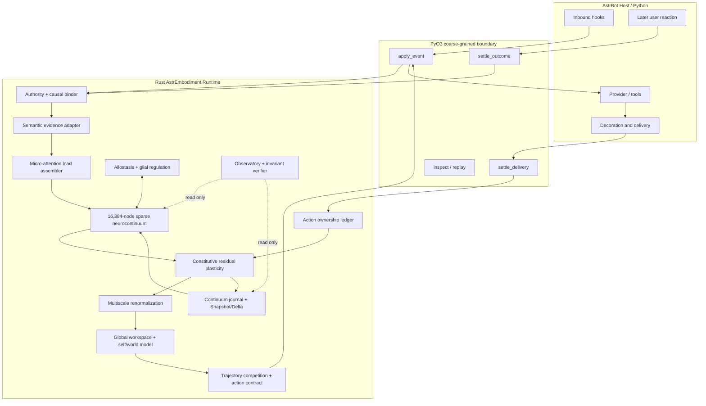

# AstrEmbodiment MVP 总架构

## 1. 设计立场

AstrEmbodiment 不是一个情绪状态机，也不是一个在 prompt 中注入 `warmth=0.7` 的语气插件。

它是一个事件驱动、Rust 原生、具有万级稀疏神经基底和多尺度世界模型的 Agent substrate：

- **神经场**负责当下体验与局部竞争；
- **本构塑性**负责不可逆历史；
- **Agent 层**负责想象未来和选择行动；
- **Continuum 层**负责同一身份的持久连续性；
- **AstrBot**负责语言模型、工具、消息平台和真实交互世界。

## 2. 系统拓扑



## 3. 一轮完整因果链

### 3.1 用户输入

1. Python 冻结 AstrBot 事件事实；
2. Rust 生成 `CanonicalEvent`；
3. Authority 层绑定来源、scope、turn、causal parent；
4. 语义估计器只生成带置信度的证据特征；
5. 微型注意力将证据装配为广义荷载；
6. 神经连续体做增量传播；
7. 本构核计算不可逆候选；
8. 多尺度层把 16K 节点收敛为 32 个工作空间 token；
9. Self/World Model 生成 4–6 条连续行动轨迹；
10. 轨迹竞争产生 `ActionContract`；
11. Python 把合同投影为 provider 临时上下文。

### 3.2 模型输出

1. LLM 生成自然语言草稿；
2. Python 提取可核验 claims、笃定程度和行为动作；
3. Expression Auditor 检查是否符合合同；
4. 通过 AstrBot 装饰链得到最终文本、TTS、图片或工具行为；
5. 真正投递成功后，Rust 才提交 `SelfAction` 和 claim ledger；
6. 未投递内容不得成为行动所有权。

### 3.3 延迟外部结果

1. 下一轮用户反应、显式反馈或 verifier 结论到达；
2. 必须匹配未过期的资格迹和 causal action；
3. Authority matrix 决定哪些连接与 residual 可写；
4. 生成塑性候选；
5. Invariant verifier 检查权限、不可逆性、图容量和 replay；
6. 唯一 writer 原子提交 Snapshot/Delta。

## 4. 不是状态机

系统可以为了诊断把输出标注为 `concise`、`firm`、`repairing`，但不能以离散分支决定人格行为。

禁止：

```python
if patience < 0.3:
    mode = "FIRM"
```

采用：


a. 神经场生成连续工作空间；

b. Agent 生成多个连续行动向量；

c. 世界模型推演每个行动的后果；

d. 以受约束作用量选出最优行动合同；

e. `FIRM` 只是对最终行动向量的可观测标签。

## 5. 作用域

### Persona scope

保存：

- 16,384 节点神经场；
- 动态连接图；
- 核心人格；
- 全局身体/异稳态状态；
- Global Workspace 参数；
- FormulaProfile。

### Relation scope

保存：

- bond、friction、boundary、scar、repair 等不可逆 residual；
- 当前 relation activation；
- 与该关系绑定的资格迹摘要；
- 未结算 action reference。

每个关系不能复制一颗 16K 大脑。

### Turn scope

保存：

- 当前事件权威；
- request-local 神经候选；
- action contract；
- claim candidate；
- delivery token。

终态后大部分 Turn 数据必须释放。

## 6. 单一写者

任何模块都不能直接修改权威状态：

```text
Attention         → LoadCandidate
Neurofield        → NeuralTrial
Mechanics         → PlasticityCandidate
Agent             → ActionContract
Delivery          → DeliveryEvidence
Verifier          → CorrectionVerdict
```

只有 `ae-runtime::CommitLane` 可以把验证后的候选写入 store。

## 7. FormulaProfile 与 RuntimeEnvelope

### FormulaProfile

决定她是谁，参与 digest 并随 Snapshot 持久化：

- 节点数量；
- 区域布局；
- OperatorBank；
- 人格参数；
- 本构参数；
- 塑性阈值；
- 多尺度映射；
- 候选行动数量和推演步数；
- 数值容差。

### RuntimeEnvelope

只决定当前机器怎么完成同一次计算，不进入状态：

- 线程数量；
- 缓存大小；
- trace 保留量；
- 后台维护切片；
- rollout 并行度；
- WebUI 刷新频率。

必须满足：

\[
\operatorname{Digest}(S_n^{2C2G})
=
\operatorname{Digest}(S_n^{1C1G})
\]

## 8. 失败策略

| 失败 | 行为 |
|---|---|
| native core 未加载 | 插件明确拒绝激活，不启用 Python fallback |
| semantic estimator 超时 | 使用低权限、低置信本地证据；不得形成高风险 residual |
| verifier 无法确认 | `Unresolved`，fallibility 不写入 |
| delivery 未确认 | action ownership 不提交 |
| Snapshot 候选校验失败 | 继续使用旧 committed Snapshot |
| stale turn/outcome | 丢弃，不借用最新 turn |
| 资源不足 | 先缩缓存/诊断/后台维护；核心公式不变；仍不足则拒绝启动 |
| 图容量满 | 只允许候选修剪后再生长，不扩容 |

## 9. MVP 首要性能路径

实时请求只允许：

- 有界本地状态读取；
- 一次稀疏注意力；
- 1–3 个神经增量步；
- 一次多尺度 restriction；
- 4–6 个粗尺度 rollout；
- 一次 action contract 生成；
- 一次有界事务。

图重组、Snapshot 重建、历史 replay、结构修剪和重型 Observatory 聚合进入后台维护 lane，不阻塞 AstrBot provider 请求。
