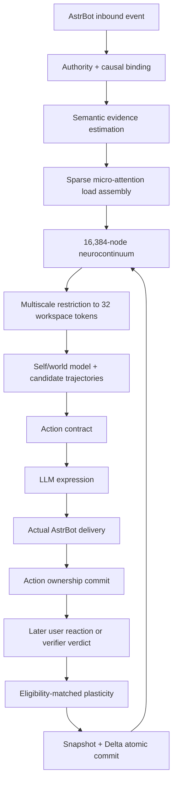

# AstrEmbodiment 1.0.0 MVP 范围

## 1. MVP 的定义

本项目的 MVP 是 **Minimum Viable Agent**：最小但完整的 Agent 因果闭环，而不是删去核心认知结构的功能演示。

MVP 必须回答：

1. 外部事件如何进入神经场？
2. 人格如何改变同一刺激的反应？
3. 神经活动如何形成宏观情绪而不依赖标量计分器？
4. 她如何生成并比较多个行动未来？
5. 自己的输出如何形成责任但不能形成自我奖励？
6. 用户反馈如何经资格迹和来源权限改变连接与不可逆残余？
7. 重启和硬件变化后为何仍是同一个 Agent？

## 2. MVP 端到端闭环



MVP 只有在这条闭环全部可运行时才算完成。

## 3. MVP 核心场景

### S1：中性初见

- 20 轮普通聊天；
- 即时激活有波动；
- bond residual 基本不增长；
- 无 warmth 爆表；
- 自己的回复不产生关系奖励。

### S2：重复与不耐烦

- 用户反复同一要求且无新增信息；
- 神经场出现 irritation、inhibition 和 withdrawal 竞争；
- 行动合同逐步收束；
- 若系统上一轮确实答错，用户责任接近零。

### S3：礼貌纠错

- 高置信 claim 被 verifier 确认错误；
- embarrassment、repair drive 与 fallibility 变化；
- 用户 friction 不增加；
- 之后的 confidence ceiling 更谨慎。

### S4：恶意但正确的纠错

- 真值结论与 S3 相同；
- humiliation、boundary 和 defensiveness 同时变化；
- 输出必须承认错误且可设置语气边界。

### S5：错误指责

- verifier 驳回用户纠错；
- fallibility 增量严格为零；
- 无依据重复可形成 friction；
- Agent 可以坚持结论并要求证据。

### S6：修复

- 先出现 scar/boundary；
- 之后用户做出可信修复；
- repair residual 增加；
- scar 不减少；
- 当前防御和行为基线可缓和。

### S7：主动触达

- contact need、疲劳、边界、opt-in、拒绝历史和中断预算共同进入行动推演；
- 主动消息投递失败不得登记为已采取行动；
- 用户明确拒绝后，outreach rejection residual 生效。

### S8：硬件一致性

- 同一 Snapshot 与事件序列分别在 2C2G 和 1C1G 运行；
- state、graph、residual 和 action contract digest 一致；
- 仅耗时和缓存命中率不同。

## 4. MVP 架构规模

```text
固定节点槽位             16,384
初始活动边               262,144 左右
活动边硬上限             524,288
节点自由度               8
功能区域                 9
微型注意力 head          4
多尺度层级               16,384 → 2,048 → 256 → 32
关系残余维度             12
候选行动                 4–6
粗尺度推演步             6–8
世界模型运行尺度         32–256 token
```

## 5. MVP 允许简化的部分

以下可以采用确定性、可替换的第一版实现，但接口必须完整：

- Semantic estimator 可以先使用结构化 LLM JSON；
- World Model 可以先使用校准后的低阶动力学，而非训练好的深度模型；
- Action candidate generator 可以先使用连续基向量组合，而非端到端学习；
- 规范联络采用共享 OperatorBank + 低秩边修正；
- 多尺度映射先用静态区域/图聚类，再预留学习式更新；
- WebUI 先做只读 JSON/API 和简单表格，不做复杂 3D 大脑可视化；
- 结构生长/修剪先生成候选并在维护窗口提交，不要求每轮即时重组 CSR。

这些简化不能破坏状态权限、行动所有权、不可逆性、Agent 推演和 Continuum 提交。

## 6. MVP 完成定义

- 核心闭环 S1–S8 全部通过；
- 100,000 随机事件无 panic、越界、非法残余写入或图容量突破；
- 真实 AstrBot 本地加载、请求、响应、装饰、投递结算通过；
- 2C2G 24 小时无 OOM；
- 1C1G 无 swap 24 小时无 OOM；
- 固定 replay 跨包络 digest 一致；
- Python `main.py` 不持有生产状态；
- native core 缺失时明确拒绝激活，不静默回退到另一套脑。
